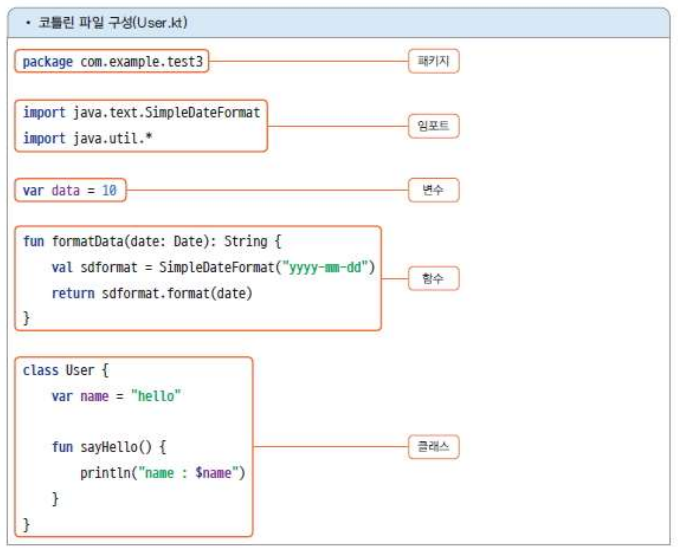
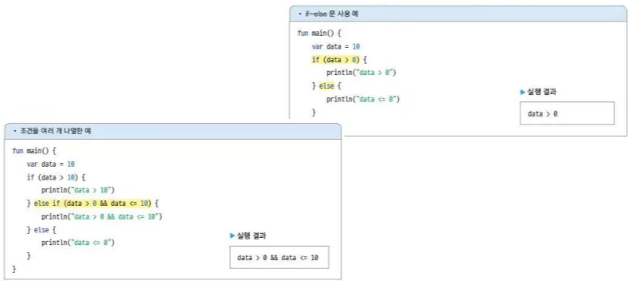

# 2. 코틀린 이해하기

# 코틀린 시작하기

## 1) 코틀린 언어 소개

### 코틀린의 등장 배경

- 코틀린은 JetBrains에서 오픈소스 그룹을 만들어 개발한 프로그래밍 언어
- JVM에 기반을 둔 언어
- 코틀린 컴파일러(kotlinc)가 .kt 파일을 컴파일하면 자바 바이트 코드가 만들어
- 코틀린의 이점
    - 표현력과 간결함 - 최신 언어 기법을 이용하면 훨씬 간결한 구문으로 프로그램을 작성
    - 안전한 코드 - 코틀린은 널 안전성 null safety을 지원하는 언어
    (널 허용과 널 불허용으로 구분해서 선언함)
    - 상호 운용성 - 코틀린은 자바와 100% 호환 (자바 클래스나 라이브러리 활용 가능, 혼용 가능)
    - 구조화 동시성 - 코루틴 coroutines이라는 기법을 이용하면 비동기 프로그래밍을 간소화할 수 있음
    (네트워크 연동이나 db 갱신과 같은 작업 시 이용하면 더 간단하고 효율적으로 작성 가능)

### 코틀린 파일 구성

- 코틀린 파일의 확장자 .kt
    
    
    
- package : 이 파일을 컴파일했을 때 만들어지는 클래스 파일의 위치
(kt 파일의 위치와 상관없는 별도의 이름으로도 선언 가능)
- 변수와 함수는 클래스 안 뿐 아니라 클래스 밖(최상위)에도 선언 가능


- 어떤 파일에 선언한 멤버(변수, 함수, 클래스)를 다른 코틀린 파일에서 참조할 때, 두 파일을 같은 package로 선언했다면 import 없이 사용 가능
- 다른 package로 선언했다면 사용할 멤버를 import 구문으로 지정해야 함

### 코틀린 소스를 테스트하는 방법

- 테스트할 코틀린 소스 파일에는 main() 함수가 있어야 하며, 
실행하면 main() 함수가 자동으로 실행됐다가 끝나면 프로그램 종료
    
    
    

## 2) 변수와 함수

### 변수 선언하기

- 변수는 val, var 키워드로 선언
- val : value의 줄임말로 초깃값이 할당되면 바꿀 수 없는 변수 선언
- var : variable의 줄임말로 초깃값이 할당된 후에도 값을 바꿀 수 있는 변수 선언
    
    
    
- 타입 지정과 타입 추론
    - 변수명 뒤에는 콜론(:)을 추가해 타입을 명시
    - 대입하는 값에 따라 타입을 유추(타입 추론)할 수 있을 때는 생략
    
    
    
- 초깃값 할당
    - 최상위에 선언한 변수나 클래스의 멤버 변수는 선언과 동시에 초깃값을 할당해야 하며, 
    함수 내부에 선언한 변수는 선언과 동시에 초깃값을 할당하지 않아도 됨
    
    
    
- 초기화 미루기
    - 변수를 선언할 때 초깃값을 할당할 수 없는 경우 lateinit, lazy 키워드 이용
    - lateinit : 이후에 초깃값을 할당할 것임을 명시적으로 선언
        - lateinit은 var 키워드로 선언한 변수에만 사용할 수 있음
        - Int, Long, Short, Double, Float, Boolean, Byte 타입에는 사용 불가
        
        
        
    - lazy : 변수 선언문 뒤에 by lazy { } 형식으로 선언
        - 소스에서 변수가 최초로 이용되는 순간 중괄호로 묶은 부분이 자동으로 실행되어 그 결괏값이 변수의 초깃값으로 할당
        - 중괄호 부분을 여러 줄로 작성하면 마지막 줄의 실행 결과가 변수의 초깃값이 됨
        
        
        

### 데이터 타입

- 코틀린의 모든 변수는 객체
    - Int 타입이 기초 데이터 타입이라면 변수에 null을 대입할 수 없으며, 호출 불가
    - but, 코틀린의 모든 타입은 객체이므로 null 대입 가능, 객체의 메서드도 호출 가능
    (null은 객체가 선언만 되고 메모리 할당이 되지 않았음을 의미)
    
    
    
- Int, Short, Long, Double, Float, Byte, Boolean ― 기초 타입 객체
    
    
    
- Char, String ― 문자와 문자열
    - Char 타입 : 문자를 작은 따옴표로 감싸서 표현, Number 타입으로 표현 불가
    - String 타입 : 문자열을 큰따옴표(“)나 삼중 따옴표(“””)로 감싸서 표현
        - 큰따옴표로 표현한 경우, 줄바꿈이나 들여쓰기에 이스케이프 시퀀스 입력
        - 삼중 따옴표로 표현한 경우 그대로 반영됨
        - 문자열 템플릿 : String 타입의 데이터에 변숫값이나 어떤 연산식의 결괏값을 포함해야 할 때 $ 기호 이용


- Any ― 모든 타입 가능
    - 최상위 클래스로 모든 타입의 데이터 할당 가능
    
    
    
- Unit ― 반환문이 없는 함수
    - 데이터 형식이 아닌 특수한 상황 표현 목적
    - Unit 타입으로 선언한 변수에는 Unit 객체만 대입 가능 (=의미 없음)
    - 주로 함수의 반환 타입으로 사용함 (반환문이 없음을 명시적으로 나타냄)
    → 함수 선언 시 반환 타입을 생략하면 자동으로 Unit이 적용됨
    
    
    
- Nothing ― null이나 예외를 반환하는 함수
    - 데이터 형식이 아닌 특수한 상황 표현 목적
    - Nothing으로 선언한 변수에는 null만 대입 가능 (=의미 없음)
    - 주로 함수의 반환 타입으로 사용함 (반환 타입이 Nothing이면 반환은 하지만 의미 있는 값은 아니라는 의미) → 항상 null만 반환하는 함수나 예외를 던지는 함수의 반환 타입을 Nothing으로 선언
    
    
    
- 널 허용과 불허용
    - 타입 뒤에 물음표로 표시
    - 물음표를 추가하면 널 허용, 아니면 널 불허용
    
    
    

### 함수 선언하기

- 함수를 선언하려면 fun 키워드 이용
- 반환 타입을 선언할 수 있으며 생략하면 자동으로 Unit 타입 적용
- 함수의 매개변수에는 var나 val 키워드를 사용할 수 없으며 val이 자동으로 적용
(함수 안에서 매개변숫값을 변경할 수 없음)
    
    
    
- 함수의 매개변수에는 기본값 선언 가능
(인자를 전달하지 않아도 기본값 적용됨)
    
    
    
- 매개변수명을 지정하여 호출하는 것을 명명된 매개변수라고 하며, 
이렇게 하면 함수 선언문의 매개변수 순서에 맞춰 호출하지 않아도 됨
    
    
    

### 컬렉션 타입

- Array ― 배열 표현
    - 배열은 Array 클래스로 표현
    - Array 클래스의 생성자에서 첫 번째 매개변수는 배열의 크기, 두 번째 매개변수는 초깃값을 지정하는 함수
    - 배열의 타입은 제네릭으로 표현 (*제네릭 : 선언하는 곳이 아니라 이용하는 곳에서 타입 지정)
    - 배열의 데이터에 접근할 때는 대괄호를 이용해도 되고 set()이나 get() 함수도 이용 가능
    
    
    
- 기초 타입의 배열
    - 기초 타입이라면 Array를 사용하지 않고 BooleanArray, ByteArray, CharArray, DoubleArray, FloatArray, IntArray, LongArray, ShortArray클래스를 이용할 수도 있음
    
    
    
    - arrayOf()라는 함수를 이용하면 배열을 선언할 때 값을 할당할 수도 있음
    - 기초 타입을 대상으로 하는 booleanArrayOf(), byteArrayOf(), char ArrayOf(), doubleArrayOf(), floatArrayOf(), intArrayOf(), longArrayOf(), shortArrayOf() 함수를 제공
    
    
    
- List, Set, Map
    - List : 순서가 있는 데이터 집합으로 데이터의 중복 허용
    - Set : 순서가 없으며 데이터의 중복 허용하지 않음
    - Map : 키와 값으로 이루어진 데이터 집합으로 순서가 없으며 키의 중복은 허용하지 않음
        - Map 객체의 키와 값은 Pair 객체를 이용할 수도 있고 ‘키 to 값’ 형태로 이용할 수도 있음
    - Collection 타입의 클래스는 가변 클래스와 불변 클래스로 나뉨
        - 불변 클래스 - 초기에 데이터를 대입하면 더 이상 변경할 수 없는 타입
        - 가변 클래스 - 초깃값을 대입한 이후에도 데이터를 추가하거나 변경 가능
    
    
    
    
    
    
    

## 3) 조건문과 반복문

### 조건문 if~else와 표현식



- 코틀린에서 if~else는 표현식으로도 사용할 수 있음 (else 생략 불가, 반환하는 결괏값은 각 영역의 마지막 줄)
- 표현식이란 결괏값을 반환하는 계산식을 말함
    
    
    

### 조건문 when

- when 문의 조건으로 정수가 아닌 다른 타입의 데이터를 지정할 수도 있음


- when 문에서는 조건을 데이터 타입, 범위 등으로 다양하게 명시할 수 있음
- is는 타입을 확인하는 연산자이며 in은 범위 지정 연산자
    
    
    
- 데이터를 명시하지 않고 조건만 명시할 수도 있음
- when은 if 문과 마찬가지로 표현식으로도 사용할 수 있음 (else문 생략 불가)
    
    
    

### 반복문 for와 while

- for 문 : 제어 변숫값을 증감하면서 특정 조건이 참일 때까지 구문을 반복해서 실행
- for 문의 조건에는 주로 범위 연산자인 in 사용
    - for (i in 1..10) { ... } → 1부터 10까지 1씩 증가
    - for (i in 1 until 10) { ... } → 1부터 9까지 1씩 증가(10은 미포함)
    - for (i in 2..10 step 2) { ... } → 2부터 10까지 2씩 증가
    - for (i in 10 downTo 1) { ... } → 10부터 1까지 1씩 감소
    
    
    
    - 컬렉션 타입의 데이터 개수만큼 반복
    - indices는 컬렉션 타입의 인덱스 값을 의미
    - 인덱스와 실제 데이터를 함께 가져오려면 withIndex() 함수 이용
    
    
    
- while 문은 조건이 참이면 중괄호 {}로 지정한 영역을 반복해서 실행
    
    
    

# 코틀린 객체지향 프로그래밍

## 1) 클래스와 생성자

### 클래스 선언

- 클래스는 class 키워드로 선언
- 클래스의 본문에 입력하는 내용이 없다면 { }를 생략 가능
    
    <aside>
    
    
    **본문은 없고 선언부만 있는 클래스가 의미 있나?**
    
    → 자바에서는 의미 없지만, 코틀린에서는 클래스의 생성자를 본문이 아닌 선언부에 작성할 수 있어서 본문 없는 클래스도 의미 있음
    
    </aside>
    
- 클래스의 멤버는 생성자, 변수, 함수, 클래스로 구성
- 생성자는 constructor 키워드로 선언하는 함수
- 클래스는 객체를 생성해 사용하며 객체로 클래스의 멤버에 접근
- 객체를 생성할 때 new 키워드를 사용하지 않음 → 클래스 이름과 같은 함수로 객체 생성
(생성자의 매개변수와 맞아야 함)


### 주 생성자

- 생성자를 주 생성자와 보조 생성자로 구분 (둘 다 선언 가능)
- 주 생성자는 constructor 키워드로 클래스 선언부에 선언
- 주 생성자 선언은 필수는 아니며 한 클래스에 하나만 가능
- constructor 키워드는 생략 가능
- 주 생성자를 선언하지 않으면 컴파일러가 매개변수 없는 주 생성자를 자동으로 추가함
    
    
    
- 주 생성자의 본문 ― init 영역
    - init 키워드를 이용해 주 생성자의 본문을 구현할 수 있음
    (주 생성자는 클래스 선언부에 있어서 중괄호를 추가할 수 없음)
    - init 키워드로 지정한 영역은 객체를 생성할 때 자동으로 실행
    (주 생성자뿐만 아니라 보조 생성자로 객체를 생성할 때도 실행됨)
    
    
    
- 생성자의 매개변수를 클래스의 멤버 변수로 선언하는 방법
    - 생성자의 매개변수는 기본적으로 생성자에서만 사용할 수 있는 지역 변수
    
    
    
    - 생성자의 매개변수를 클래스의 멤버 변수처럼 다른 함수에서 사용해야 한다면?
        
        ```kotlin
        class User(name: String, count: Int) {
        	// 클래스 멤버 변수 선언
        	var name: String
        	var count: Int
        	init {
        		// 클래스 멤버 변수에 생성자 매개변숫값 대입
        		this.name = name
        		this.count = count
        	}
        	
        	fun someFun() {
        		println("name : $name, count : $count")
        	}
        }
        
        fun main() {
        	val user = User("kwon", 10)
        	user.someFum()
        }
        ```
        
        - 더 간단한 방법 → 매개변수를 var나 val 키워드로 선언하면 클래스의 멤버 변수가 됨
            - 원래 함수는 매개변수에 키워드를 추가할 수 없지만, 주 생성자에서만 유일하게 키워드로 선언할 수 있음
            
            
            

### 보조 생성자

- 보조 생성자는 클래스의 본문에 constructor 키워드로 선언하는 함수
- 여러 개를 추가할 수 있음
- 객체를 생성할 때 자동 호출됨
- 보조 생성자는 클래스의 본문에 선언하므로 생성자 본문을 중괄호로 묶어서 실행 영역 지정 가능
    
    
    
- 보조 생성자에 주 생성자 연결
    - 주 생성자와 보조 생성자 모두 선언한다면 반드시 연결해야 함
    - 보조 생성자로 객체를 생성할 때 클래스 내에 주 생성자가 있다면 this() 구문을 이용해 주 생성자를 호출해야 함
    
    
    
    
    

<aside>


**주 생성자와 보조 생성자로 구분하는 이유**

→ 객체를 여러 가지 형태로 생성할 수 있도록 생성자의 매개변수를 다양하게 구성할 때, 
생성자의 공통된 코드는 주 생성자에 작성하라는 의미

</aside>

## 2) 클래스를 재사용하는 상속

### 상속과 생성자

- 코틀린에서 어떤 클래스를 상속받으려면 선언부에 콜론(:)과 함께 상속받을 클래스 이름을 입력
- 코틀린의 클래스는 기본적으로 다른 클래스가 상속할 수 없음
→ 다른 클래스에서 상속할 수 있게 선언하려면 open 키워드 사용
- 상위 클래스를 상속받은 하위 클래스의 생성자에서는 상위 클래스의 생성자를 호출해야 함
- 보조 생성자만 있다면 선언부가 아닌 보조 생성자에 작성 가
    
    
    

### 오버라이딩 — 재정의

- 상속이 주는 최고의 이점은 상위 클래스에 정의된 멤버(변수, 함수)를 
하위 클래스에서 자신의 멤버처럼 사용할 수 있다는 것
- 오버라이딩 : 상위 클래스에 선언된 변수나 함수를 같은 이름으로 하위에서 다시 선언하는 것
- open 키워드를 이용해 오버라이디 허용, 재정의 시 override 키워드 작성


### 접근 제한자

- 접근 제한자 : 클래스의 멤버를 외부의 어느 범위까지 이용하게 할 것인지를 결정하는 키워드
    - 생략하면 public이 기본
    - 모듈 : 그래들이나 메이븐 같은 빌드 도구에서 프로젝트 단위 또는 같은 세트 단위
    
    
    


## 3) 코틀린의 클래스 종류

### 데이터 클래스

- 데이터 클래스는 data 키워드로 선언
- 데이터 클래스는 VO(value-object) 클래스를 편리하게 이용할 수 있는 방법 제공
    
    
    
- 객체의 데이터를 비교하는 equals() 함수
    - equals() 함수는 주 생성자에 선언한 멤버 변수의 데이터만 비교 대상으로 삼음
    
    
    
    
    
- 객체의 데이터를 반환하는 toString() 함수
    - 데이터 클래스를 사용하면서 객체가 가지는 값을 확인해야 할 때 이용
    - 주 생성자의 매개변수에 선언된 데이터만 출력 대상
    
    
    

### 오브젝트 클래스

- 오브젝트 클래스는 익명 클래스를 만들 목적으로 사용
- 선언과 동시에 객체를 생성한다는 의미에서 object라는 키워드 사용
    - 타입을 명시하지 않아 최상위 타입인 Any로 취급해서 오류 발생
    
    
    
    - 오브젝트 클래스의 타입은 object 뒤에 콜론(:)을 입력하고 그 뒤에 클래스의 상위 또는 인터페이스를 입력
    
    
    

### 컴패니언 클래스

- 컴패니언 클래스는 멤버 변수나 함수를 클래스 이름으로 접근하고자 할 때 사용
- companion이라는 키워드로 선언


# 코틀린의 유용한 기법

## 1) 람다 함수와 고차 함수

### 람다 함수

- 람다 함수는 익명 함수 정의 기법
- 람다 함수 선언과 호출
    - 람다 함수는 fun 키워드를 이용하지 않으며 함수 이름이 없음
    - 람다 함수는 { }로 표현
    - { } 안에 화살표( -> )가 있으며 화살표 왼쪽은 매개변수, 오른쪽은 함수 본문
    - 함수의 반환 값은 함수 본문의 마지막 표현식


→ sum(10, 20) 호출 가능, 선언과 동시 호출 가능 {람다식} (10, 20)

- 매개변수 없는 람다 함수
    - 매개변수가 없을 경우 비워 두거나 화살표까지 생략 가능
    
    
    
- 매개변수가 1개인 람다 함수
    - 매개변수가 1개일 때는 매개변수를 선언하지 않아도 it 키워드로 매개변수를 이용할 수 있음
    - 해당 매개 변수의 타입을 식별할 수 있을 때만 사용 가능
    
    
    
- 람다 함수의 반환
    - 람다 함수에서는 return 문을 사용할 수 없음
    - 람다 함수의 반환 값은 본문에서 마지막 줄의 실행 결과
    
    
    

### 함수 타입과 고차 함수

- 코틀린에서는 함수를 변수에 대입할 수 있음, 변수는 타입 유추할 수 있을 때 제외하고 생략 불가
→ 변수에 함수를 대입하려면 변수를 함수 타입으로 선언해야 함
- 함수 타입 선언
    - 함수 타입이란 함수를 선언할 때 나타내는 매개변수와 반환 타입을 의미
    
    
    
- 타입 별칭 ― typealias
    - typealias는 타입의 별칭을 선언하는 키워드
    
    
    
- 매개변수 타입 생략
    - 매개변수의 타입을 유추할 수 있다면 타입 선언을 생략할 수 있음
    
    
    
- 고차 함수
    - 고차 함수란 함수를 매개변수로 전달받거나 반환하는 함수를 의미
    
    
    

## 2) 널 안정성

### 널 안전성이란?

- 널(null)이란 객체가 선언되었지만 초기화되지 않은 상태를 의미
- 널인 상태의 객체를 이용하면 널 포인트 예외(NullPointException)가 발생
- 널 안정성이란 널 포인트 예외가 발생하지 않도록 코드를 작성하는 것
    
    
    
- 프로그래밍 언어가 널 안전성을 지원한다는 것은 객체가 널인 상황에서 널 포인터 예외가 발생하지 않도록 연산자를비롯해 여러 기법을 제공한다는 의미
    
    
    

### 널 안전성 연산자

- 널 허용 ― ? 연산자
    - 코틀린에서는 변수 타입을 널 허용과 널 불허로 구분
    
    
    
- 널 안전성 호출 ― ?. 연산자
    - 널 허용으로 선언한 변수의 멤버에 접근할 때는 반드시 ?. 연산자를 이용해야 함
    
    
    
- 엘비스 ― ?: 연산자
    - 널일 때 대입해야 하는 값이나 실행해야 하는 구문이 있는 경우 이용
    
    
    
- 예외 발생 ― !! 연산자
    - 객체가 널일 때 예외를 일으키는 연산자
    
    