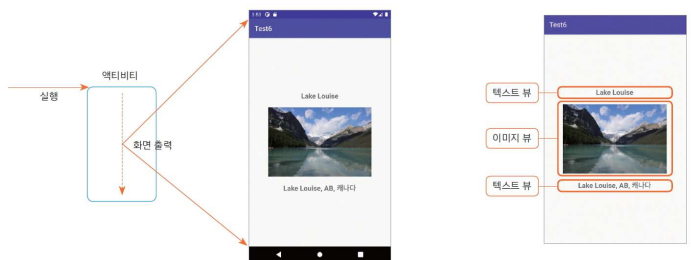
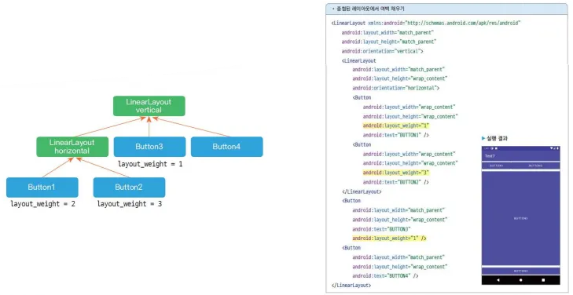

# 3. 앱의 기본 기능 구현하기 - (1)

# 뷰를 이용한 화면 구성

## 1) 화면을 구성하는 방법

### 액티비티-뷰 구조

- 화면을 출력하는 컴포넌트는 액티비티
- 화면에 내용을 표시하려면 뷰 클래스를 이용
- 화면이 10개라면 액티비티도 10개? → Fragment이용 시 화면 10개를 액티비티 1개로 만들 수 있음



- 액티비티에서 뷰로 홤녕르 구성하는 방법 2가지
    1. 액티비티 코드로 작성
    2. 레이아웃 XML 파일로 작성

### 액티비티 코드로 화면 구성하기

```kotlin
package com.example.androidlab

import android.graphics.Typeface
import androidx.appcompat.app.AppCompatActivity
import android.os.Bundle
import android.view.Gravity
import android.view.ViewGroup.LayoutParams.WRAP_CONTENT
import android.widget.ImageView
import android.widget.LinearLayout
import android.widget.TextView
import androidx.core.content.ContextCompat

class MainActivity : AppCompatActivity() {
    override fun onCreate(savedInstanceState: Bundle?) {
        super.onCreate(savedInstanceState)
        **// 이름 문자열 출력 TextView 생성
        val name = TextView(this).apply {
            typeface = Typeface.DEFAULT_BOLD
            text = "Lake Louise"
        }
        // 이미지 출력 ImageView 생성
        val image = ImageView(this).also {
            it.setImageDrawable(ContextCompat.getDrawable(this, R.drawable.lake_1))
        }
        // 주소 문자열 출력 TextView 생성
        val address = TextView(this).apply {
            typeface = Typeface.DEFAULT_BOLD
            text = "Lake Louise, AB, 캐나다"
        }
        val layout = LinearLayout(this).apply {
            orientation = LinearLayout.VERTICAL
            gravity = Gravity.CENTER
            // LinearLayout 객체에 TextView, ImageView, TextView 객체 추가
            addView(name, WRAP_CONTENT, WRAP_CONTENT)
            addView(image, WRAP_CONTENT, WRAP_CONTENT)
            addView(address, WRAP_CONTENT, WRAP_CONTENT)
        }
        // LinearLayout 객체를 화면에 출력
        setContentView(layout)**
    }
}
```

### 레이아웃 XML로 화면 구성하기

```xml
<?xml version="1.0" encoding="utf-8"?>
<LinearLayout xmlns:android="http://schemas.android.com/apk/res/android"
    android:layout_width="match_parent"
    android:layout_height="match_parent"
    android:gravity="center"
    android:orientation="vertical">

    <TextView
        android:layout_width="wrap_content"
        android:layout_height="wrap_content"
        android:text="Lake Louise"
        android:textStyle="bold" />

    <ImageView
        android:layout_width="wrap_content"
        android:layout_height="wrap_content"
        android:src="@drawable/lake_1" />

    <TextView
        android:layout_width="wrap_content"
        android:layout_height="wrap_content"
        android:text="Lake Louise, AB, 캐나다"
        android:textStyle="bold" />
</LinearLayout>
```

```kotlin
// 액티비티 파일
package com.example.androidlab

import android.graphics.Typeface
import androidx.appcompat.app.AppCompatActivity
import android.os.Bundle
import android.view.Gravity
import android.view.ViewGroup.LayoutParams.WRAP_CONTENT
import android.widget.ImageView
import android.widget.LinearLayout
import android.widget.TextView
import androidx.core.content.ContextCompat

class MainActivity : AppCompatActivity() {
    override fun onCreate(savedInstanceState: Bundle?) {
        super.onCreate(savedInstanceState)
        **setContentView(R.layout.activity_main)**
    }
}
```

<aside>


**화면을 구현하는 두 방법 중 더 좋은 방법은?**

→ 효율성을 고려하면 XML 파일로 화면을 구현하는 것이 좋음

→ 액티비티에서는 네트워킹, 데이터 핸들링, 사용자 이벤트 처리 등의 코드만 작성

</aside>

## 2) 뷰 클래스

### 뷰 클래스의 기본 구조

- 뷰 객체의 계층 구조
    - View : 모든 뷰 클래스의 최상위 클래스입니다. 액티비티는 View의 서브 클래스만 화면에 출력
    - ViewGroup : 자체 UI는 없이 다른 뷰 여러 개를 묶어서 제어할 목적으로 사용 
    (컨테이너 기능 담당, 실제로는 Layout 클래스를 사용함)
    - TextView : 특정 UI를 출력할 목적으로 사용하는 클래스
    
    
    
- ViewGroup 클래스의 하위인 레이아웃 클래스는 화면 자체가 목적이 아니라 다른 뷰(TextView, ImageView 등) 객체 여러 개를 담아서 한꺼번에 제어할 목적으로 사용
    
    
    
- 레이아웃 중첩
    - 뷰의 계층 구조는 레이아웃 객체를 중첩해서 복잡하게 구성 가능
    - 객체를 계층 구조로 만들어 이용하는 패턴을 컴포지트 패턴 또는 문서 객체 모델이라고 함
    
    
    

### 레이아웃 XML의 뷰를 코드에서 사용하기

- XML 작성하고 액티비티에서 setContentView() 함수로 XML 파일을 지정하면 화면을 출력함
- 객체를 식별하기 위한 식별자 값을 지정하기 위한 속성이 id
- XML에 id 속성을 추가하면 자동으로 R.java 파일에 상수 변수로 추가 (**`@+id/text1`**)
(XML 속성값이 @로 시작하면 R.java의 파일을 의미, R.java에 text1이라는 상수 변수를 추가)
- 코드에서 findViewById() 함수를 이용해 객체 획득
(얻은 뷰 객체의 타입을 제네릭으로 명시해도 됨)
    
    
    

### 뷰의 크기를 지정하는 방법

- 뷰가 화면에 나올 때 어떤 크기로 보여야 하는지는 필수 정보
- 크기를 설정하는 속성 : layout_width, layout_height (속성 값은 다음 3가지 중 하나)
    - 수치 - 단위 생략 불가, px / dp 등 (ex. 100px)
    - match_parent - 부모의 크기 전체 (자신보다 상위 계층의 크기)
    - wrap_content - 자신의 콘텐츠를 화면에 출력할 수 있는 적절한 크기
    (문자열의 길이, 글꼴의 크기에 따라 변경됨)
    
    
    

<aside>


**수치가 아닌 특정 설정 값을 사용하는 이유?**

→ 안드로이드 기기의 크기가 다양해서 호환성을 생각해야 하기 때문

→ 수치보다 상대적인 wrap_content나 match_parent로 크기 지정

</aside>

### 뷰의 간격 설정

- 뷰의 간격은 margin과 padding 속성으로 설정 (기본 값이 있음)
- margin, padding 속성을 이용하면 간격이 네 방향 모두 같은 크기로 설정
- 특정 방향만 변경하고 싶다면 paddingLeft, paddingRight, padding Top, paddingBottom와 layout_marginLeft, layout_margin Right, layout_marginTop, layout_marginBottom 속성 이용
    
    
    

### 뷰의 표시 여부 설정

- visibility 속성은 뷰가 화면에 출력되어야 하는지를 설정
- visible, invisible, gone으로 설정
    - invisible : 뷰가 화면에 보이지 않지만 자리는 차지
    - gone : 자리조차 차지하지 않음


- 코드에서 뷰의 visibility 속성을 조정하려면 뷰의 visibility 속성 값을 **`View.VISIBLE`**이나 **`View.INVISIBLE`**로 설정
    
    
    

<aside>


**뷰의 속성 설정 시 setter 함수를 호출해야 하는거 아닌가?**

`targetView.setVisibility(View.VISIBLE)`로 작성해도 됨

그런데 코틀린의 변수는 자바와 다르게 필드(field)가 아니라 프로퍼티(property)임

→ 변수에 setter와 getter가 내장돼 있음 (변수처럼 이용해도 내부적으로 호출됨)

```kotlin
user.name("k")
println(user.name)
```

</aside>

## 3) 기본적인 뷰 살펴보기

### 텍스트 뷰

- TextView는 문자열을 화면에 출력하는 뷰
- android:text 속성 : TextView에 출력할 문자열을 지정 (문자열, 문자열 리소스 대입 가능)
    - android:text=”helloworld”
    - android:text=”@string/hello”
- android:textColor 속성 : 문자열의 색상을 지정 (16진수 RGB 형식)
    - android:textColor=”#FF0000”
- android:textSize 속성 : 문자열의 크기를 지정 (단위 px / dp / sp, 단위 생략 불가)
    - android:textSize=”20sp”
- android:textStyle 속성 : 문자열의 스타일을 지정
    - android:textStyle=”bold”
    - bold, italic, normal 중에서 선택
    
    
    
- android:autoLink 속성 : 출력할 문자열을 분석해 특정 형태의 문자열에 자동 링크를 추가
    - android:autoLink=”web” (문자열을 링크 모양으로 표시 후 클릭 시 브라우저 실행)
    - web, phone, email 등을 사용 (여러 개를 함께 설정하려면 **`|`** 기호로 연결)
    
    
    
- android:maxLines 속성 : 문자열이 특정 줄까지만 나오도록 하는 속성 (원래는 자동 줄바꿈)
    - android:maxLines=”3”
- android:ellipsize 속성 : 문자열이 더 있다는 것을 표시하기 위한 줄임표(...)를 추가
    - end, middle, start 값 지정
    - start와 middle은 `singleLine=”true”` 속성으로 문자열을 한 줄로 출력했을 때만 적용
    
    
    

### 이미지 뷰

- 이미지를 화면에 출력하는 뷰
- android:src 속성 : 출력할 이미지를 설정 (파일 이미지, 네트워크 이미지, 리소스 이미지 등 가능)
    - android:src=”@drawable/image3”
- android:maxWidth, android:maxHeight, android:adjustViewBounds 속성 : 이미지 최대 크기 지정
    - maxWidth, maxHeight 속성은 android:adjustViewBounds 속성과 함께 사용
    - true로 설정하면 이미지의 가로세로 길이와 비례해 뷰의 크기를 맞춤
    
    
    

<aside>


**이미지 크기를 layout_width, layout_height 속성으로 설정하면?**

wrap_content로 지정하면 뷰의 크기가 지나치게 커질 수 있음 (이미지가 큰 경우)

수치로 지정하면 줄여서 출력할 수 있지만 비율이 다양하므로, 뷰의 크기가 이미지보다 커질 수 있어서 정확히 맞추지 못함

</aside>

### 버튼, 체크박스, 라디오 버튼

- Button 사용자 이벤트 처리, CheckBox 다중 선택, RadioButton 단일 선택을 제공하는 뷰
- 라디오 버튼은 RadioGroup과 함께 사용, 묶은 라디오 버튼 중 하나만 선택할 수 있게 설정
    
    
    

### 에디트 텍스트

- EditText는 글을 입력할 수 있는 뷰 (원래 한 줄 입력 크기로 출력되었다가 키보드에서 엔터 누르면 여러 줄 입력으로 늘어남)
- android:lines, android:maxLines 속성
    - android:lines 속성 : 처음부터 여러 줄 입력 크기로 나오게 함
    (`android:lines=”3”`으로 설정하면, 처음부터 3줄 입력 크기로 화면에 나오며 더 늘어나지 않음 → 더 늘어나면 안에서 스크롤이 생김)
    - maxLines : 처음에는 한 줄 입력 크기로 출력되다가 지정한 크기까지 늘어남
    (`maxLines=”3”`으로 지정하면, 엔터를 눌러서 3줄까지 늘어나며 더 늘어나지 않음 → 그 이상은 스크롤)
- android:inputType 속성
    - 글을 입력할 때 올라오는 키보드를 지정하는 속성
    - ex. 키보드로 한 줄 입력을 강제하고 싶거나, 전화번호 입력 모드로 지정하고 싶을 때 사용
    - `android:inputType=”phone”` → 전화번호 입력 모드, 한 줄 입력으로 강제
    
    
    
    
    

## 4) 뷰 바인딩

- 뷰 바인딩은 레이아웃 XML 파일에 선언한 뷰 객체를 코드에서 쉽게 이용하는 방법
- 액티비티에서 findViewById() 함수를 이용하지 않고 레이아웃 XML 파일에 등록된 뷰 객체를 쉽게 사용할 수는 방법 제공
- build.gradle 파일의 android 영역에 buildFeatures 선언 → 그 안에 뷰 바인딩 적용하라는 의미로 `viewBinding = true` 설정
    
    
    
    뷰 바인딩을 사용하기 위해 그래들 파일에 선언
    
    → 레이아웃 XML 파일에 등록된 뷰 객체를 포함하는 클래스가 자동으로 만들어짐
    
- 자동으로 만들어지는 클래스의 이름은 레이아웃 XML 파일명을 따름
    - 첫 글자를 대문자로 하고 밑줄(_)은 빼고 뒤에 오는 단어를 대문자로 만든 후 ‘Binding’ 추가
        - activity_main.xml → ActivityMainBinding
        - item_main.xml → ItemMainBinding
- 자동으로 만들어진 클래스의 inflate() 함수를 호출하면 바인딩 객체를 얻을 수 있음
(이때 인자로 layoutInflater를 전달)
- 액티비티 화면 출력은 setContentView() 함수에 binding.root를 전달하면 됨
(바인딩 객체의 root 프로퍼티에는 XML의 루트 태그 객체가 자동으로 등록됨)
- 바인딩 객체에 등록된 뷰 객체명은 XML 파일에 등록한 뷰의 id 값을 따름
(ex. `<Button android:id=”@+id/visibleBtn” />` → `binding.visibleBtn`으로 사용)
    
    
    
- 번들 파일에 뷰 바인딩 선언하면, 모든 레이아웃 XML 하나당 바인딩 클래스가 자동 생성됨
필요 없는 파일은 XML의 루트 태그에 `tools:viewBindingIgnore=”true”` 속성 추가
    
    ```xml
    <LinearLayout xmlns:android="http://schemas.android.com/apk/res/android"
    		xmlns:tools="http://schemas.android.com/tools"
    		**tools:viewBindingIgnore=”true”**>
    </LinearLayout>
    ```
    

## 5) 카카오톡 비밀번호 화면 만들기

### 1단계. 새 모듈 만들기

- 새로운 앱 개발 시 새 프로젝트로 시작해도 되지만, 똑같은 환경이라면 한 프로젝트에 새 모듈 생성해서 개발 가능 (모듈 = 앱, 새로운 모듈 = 새로운 앱)
- [File → New → NewModule] 메뉴
- Application/Library name 부분에 Ch6_View 입력

### 2단계. 문자열 리소스 등록하기

- res/values/strings.xml 파일 코드
    
    ```xml
    <resources>
        <string name="app_name">Ch6_View</string>
        <string name="main_desc">
            회원님의 소중한 정보 보호를 위해, 카카오 계정의 현재 비밀번호를 확인해 주세요.
        </string>
        <string name="password_txt">비밀번호가 기억나지 않으세요?</string>
    </resources>
    ```
    

### 3단계. 레이아웃 XML 파일 작성

- activity_main.xml 파일 코드
    
    ```xml
    <?xml version="1.0" encoding="utf-8"?>
    <LinearLayout xmlns:android="http://schemas.android.com/apk/res/android"
        android:layout_width="match_parent"
        android:layout_height="match_parent"
        android:orientation="vertical"
        android:padding="16dp">
    
        <TextView
            android:layout_width="match_parent"
            android:layout_height="wrap_content"
            android:text="@string/main_desc"
            android:textSize="17dp" />
    
        <TextView
            android:layout_width="match_parent"
            android:layout_height="wrap_content"
            android:layout_marginTop="10dp"
            android:text="kkang104@gmail.com"
            android:textColor="#CFCFCE" />
    
        <View
            android:layout_width="match_parent"
            android:layout_height="1dp"
            android:layout_marginTop="10dp"
            android:background="#D4D4D3" />
    
        <EditText
            android:layout_width="match_parent"
            android:layout_height="wrap_content"
            android:hint="비밀번호"
            android:inputType="textPassword" />
    
        <TextView
            android:layout_width="match_parent"
            android:layout_height="wrap_content"
            android:layout_marginTop="10dp"
            android:text="@string/password_txt" />
    
        <Button
            android:layout_width="match_parent"
            android:layout_height="wrap_content"
            android:layout_marginTop="16dp"
            android:text="확인" />
    </LinearLayout>
    ```
    

### 4단계. 앱 실행하기


- 버전 오류
    - 현재 사용 중인 `compileSdk` 버전(34)을 유지하면서 문제를 해결하려면, `androidx.activity:activity` 라이브러리의 버전 낮추기. 
    최신 버전(`1.10.0`)은 `compileSdk` 버전 35 이상 요구
    - **해결 방안** : 의존성 버전 다운그레이드
        
        **호환 가능 버전** : `androidx.activity:activity:1.9.0` 버전은 `compileSdk = 34`에서 정상 작동
        
        ### 수정 방법
        
        `build.gradle` 또는 `build.gradle.kts` 파일에서 `androidx.activity` 의존성을 아래와 같이 수정
        
        ```kotlin
        dependencies {
            // 기존의 implementation(libs.androidx.activity) 또는 androidx.activity:activity:1.10.0을 아래로 변경
            implementation("androidx.activity:activity:1.9.0")
        }
        ```
        
        ### or 라이브러리 버전 확인
        
        `libs` 파일을 사용 중이라면, `androidx.activity:activity`에 해당하는 버전 직접 지정
        
        ```toml
        androidx {
            activity = "1.9.0" // libs 파일에서 이 부분 수정
        }
        ```
        
        ### 실행 후 확인
        
        1. 수정 후 **Gradle Sync** 실행 : `File > Sync Project with Gradle Files`
        2. 프로젝트를 다시 빌드하고 애뮬레이터 또는 실제 디바이스에서 실행하여 정상 작동 확인

# 뷰를 배치하는 레이아웃

## 1) 선형으로 배치 — LinearLayout

### LinearLayout 배치 규칙

- LinearLayout은 뷰를 가로나 세로 방향으로 나열하는 레이아웃
- orientation 속성에 horizontal이나 vertical값으로 방향을 지정
- 화면에서 벗어나도 줄을 자동으로 바꾸지 않음
- LinearLayout을 중첩
    - 레이아웃 클래스도 뷰이므로 다른 레이아웃 클래스에 포함할 수 있


### 여백을 채우는 layout_weight 속성

- 뷰 1개로 전체 여백 채우기
    - layout_weight 속성 : 여백을 뷰로 채우려면
    
    
    
- 뷰 여러 개로 여백을 나누어 채우기
    - layout_weight 속성에 지정한 숫자는 가중치 (= 뷰가 차지하는 여백의 비율)
    - layout_weight값을 각각 1과 3으로 선언했다면 가로 여백을 각각 1/4, 3/4만큼 나누어 차지
    
    
    
- 중첩된 레이아웃에서 여백 채우기
    - layout_weight 속성은 같은 영역에 있는 뷰끼리만 여백을 나누어 차지함
    
    
    
- 여백 채우기로 뷰의 크기 설정하기
    - layout_height 값을 모두 0을 설정 (=뷰의 크기가 0이면 화면에 아무것도 나오지 않음)
    → 화면 전체가 여백
    
    
    

### 뷰를 정렬하는 gravity, layout_gravity 속성

- 뷰를 정렬할 때 gravity와 layout_gravity 속성 사용 (사용하지 않으면 기본 값은 left/top)
    - gravity 속성 : 정렬 대상은 콘텐츠
    - layout_gravity 속성 : 뷰 자체를 정렬
    
    
    
- 레이아웃에 gravity 속성 적용하기
    - layout_gravity 속성을 center_vertical(세로 중앙)값으로 지정하면 정렬 적용 X
    → LinearLayout 자체가 방향으로 뷰를 배치하는 레이아웃이므로 orientation 속성에 설정한 방향과 같은 방향으로는 적용 X
    - 뷰를 화면 가운데 표시하려면 gravity=”center”로 설정
    → 콘텐츠를 정렬하는 속성이므로, 아래 코드에서 콘텐츠는 해당 레이아웃에 추가한 뷰임
    
    
    

## 2) 상대 위치로 배치 — RelativeLayout

### RelativeLayout 배치 규칙

- 상대 뷰의 위치를 기준으로 정렬 (화면에 이미 출력된 특정 뷰를 기준으로 방향 지정)
- 각 속성에 입력하는 값은 기준이 되는 뷰의 id
    - android:layout_above: 기준 뷰의 위쪽에 배치
    - android:layout_below: 기준 뷰의 아래쪽에 배치
    - android:layout_toLeftOf: 기준 뷰의 왼쪽에 배치
    - android:layout_toRightOf: 기준 뷰의 오른쪽에 배치
    
    
    

### 맞춤 정렬하는 align 속성

- 상대 뷰의 어느 쪽에 맞춰서 정렬할지를 정하는 속성
- 각 속성에 입력하는 값은 기준이 되는 뷰의 id
    - android:layout_alignTop: 기준 뷰와 위쪽을 맞춤
    - android:layout_alignBottom: 기준 뷰와 아래쪽을 맞춤
    - android:layout_alignLeft: 기준 뷰와 왼쪽을 맞춤
    - android:layout_alignRight: 기준 뷰와 오른쪽을 맞춤
    - android:layout_alignBaseline: 기준 뷰와 텍스트 기준선을 맞춤
    
    
    
- 상위 레이아웃을 기준으로 맞춤 정렬하는 속성
    - android:layout_alignParentTop: 부모의 위쪽에 맞춤
    - android:layout_alignParentBottom: 부모의 아래쪽에 맞춤
    - android:layout_alignParentLeft: 부모의 왼쪽에 맞춤
    - android:layout_alignParentRight: 부모의 오른쪽에 맞춤
    - android:layout_centerHorizontal: 부모의 가로 방향 중앙에 맞춤
    - android:layout_centerVertical: 부모의 세로 방향 중앙에 맞춤
    - android:layout_centerInParent: 부모의 가로·세로 중앙에 맞춤
    
    
    

## 3) 겹쳐서 배치 — FrameLayout

- 카드를 쌓듯이 뷰를 추가한 순서대로 위에 겹쳐서 계속 출력하는 레이아웃
- 대부분 뷰의 표시 여부를 설정하는 visibility 속성을 함께 사용 (똑같은 위치에 여러 뷰를 겹침)
    - 탭 화면을 만들 때 많이 사용
    (버튼을 누를 때마다 화면이 바뀜→같은 위치에 화면 5개 표시 후 탭의 상태에 따라 특정 화면)


처음에 ImageView에 `android:visibility=”invisible”`로 설정


## 4) 표 형태로 배치 — GridLayout

### GridLayout 배치 규칙

- 행과 열로 구성된 테이블 화면을 만드는 레이아웃
- GridLayout에 추가한 뷰의 크기는 기본으로 wrap_content로 지정되므로 layout_width, layout_height 속성을 설정하지 않아도 오류 발생 X
- orientation 속성으로 가로나 세로 방향으로 뷰를 나열
- 줄바꿈을 자동으로 함
    - orientation : 방향 설정
    - rowCount : 세로로 나열할 뷰 개수
    - columnCount : 가로로 나열할 뷰 개수


### GridLayout 속성

- 특정 뷰의 위치 조정하기
    - layout_row : 뷰가 위치하는 세로 방향 인덱스
    - layout_column : 뷰가 위치하는 가로 방향 인덱스
    
    
    
- 특정 뷰의 크기 확장하기
    - layout_gravity 속성 이용
    - 한 칸에 뷰를 여러개 표시


- 열이나 행 병합하기
    - layout_columnSpan : 가로로 열 병합
    - layout_rowSpan : 세로로 행 병합
    
    
    

<aside>


**TableLayout도 존재**

→ 테이블에서 셀의 개수가 고정이라면 GridLayout과 큰 차이 없음

→ 셀의 개수가 변하면 불편

</aside>

## 5) 계층 구조로 배치 — ConstraintLayout

- ConstraintLayout은 androidx에서 제공하는 라이브러리
- build.gradle 파일의 dependencies에 선언 (프로젝트 생성 시 자동 추가됨)
`implementation ‘androidx.constraintlayout:constraintlayout:2.1.1’`

### 레이아웃 편집기에서 레이아웃 구성하기

- 상대 위치로 배치하는 RelativeLayout과 비슷하지만 더 많은 속성을 제공
- 레이아웃 편집기를 제공
    1. 팔레트(Palette) : 레이아웃을 구성할 수 있는 다양한 뷰와 뷰 그룹
    2. 컴포넌트 트리(Component Tree) : 레이아웃에서 구성 요소의 계층 구조 표시
    3. 툴바(Toolbar) : 레이아웃 속성 설정
    4. 디자인 편집기(Design editor) : 디자인 뷰나 청사진 뷰 작업 영역
    5. 속성(Attributes) : 선택한 뷰의 속성을 지정
    6. 보기 모드(View mode) : 레이아웃 모드 선택
    7. 화면 조절(Zoom and pan control) : 확대/축소 및 화면 이동 조절
    
    
    
- 이미지 추가
    - 이미지 선택
    - id값 지정
    - layout_width, layout_htight값 지정
    - layout영역에서 + 버튼으로 부모 영역에서 어느 정도의 여백으로 출력해야 하는지 설정 (상대)
    
    
    
- 제목 추가
    - id값 지정
    - 이미지 뷰의 오른쪽에 여백을 두고 출력하려면, 작업 창에서 동그라미 버튼을 끌어 이미지에 두기 (이미지 뷰 오른쪽에 텍스트 뷰를 지정하기 = start to image view end)
    - 동그라미 버튼을 끌어 이미지 위쪽 버튼에 놓으면 뷰의 위를 기준으로 정렬할 수 있음
    
    
    
- 메시지 추가, 날짜 추가
    
    
    


### XML 코드로 확인하기

- 코드
    
    ```xml
    <androidx.constraintlayout.widget.ConstraintLayout xmlns:android="http://schemas.android.com/apk/res/android"
        xmlns:app="http://schemas.android.com/apk/res-auto"
        xmlns:tools="http://schemas.android.com/tools"
        android:id="@+id/titleView"
        android:layout_width="match_parent"
        android:layout_height="match_parent"
        tools:context=".MainActivity">
    
        <ImageView
            android:id="@+id/imageView"
            android:layout_width="50dp"
            android:layout_height="50dp"
            android:layout_marginStart="16dp"
            android:layout_marginTop="32dp"
            app:layout_constraintStart_toStartOf="parent"
            app:layout_constraintTop_toTopOf="parent"
            tools:srcCompat="@tools:sample/avatars" />
    
        <TextView
            android:id="@+id/textView"
            android:layout_width="wrap_content"
            android:layout_height="wrap_content"
            android:layout_marginStart="16dp"
            android:text="카카오톡"
            app:layout_constraintStart_toEndOf="@+id/imageView"
            app:layout_constraintTop_toTopOf="@+id/imageView" />
    
        <TextView
            android:id="@+id/messageView"
            android:layout_width="wrap_content"
            android:layout_height="wrap_content"
            android:layout_marginStart="16dp"
            android:text="기기 로그인 알림"
            app:layout_constraintBottom_toBottomOf="@+id/imageView"
            app:layout_constraintStart_toEndOf="@+id/imageView" />
    
        <TextView
            android:id="@+id/dateView"
            android:layout_width="wrap_content"
            android:layout_height="wrap_content"
            android:layout_marginTop="32dp"
            android:layout_marginEnd="16dp"
            android:text="9월 7일"
            app:layout_constraintEnd_toEndOf="parent"
            app:layout_constraintTop_toTopOf="parent" />
    </androidx.constraintlayout.widget.ConstraintLayout>
    ```
    

## 6) 전화 앱의 키패드 화면 만들기

### 1단계. 새로운 모듈 생성하기

### 2단계. 이미지 파일 넣기

- add, back, call, video.png를 res/drawable 폴더에 넣기

### 3단계. 메인 액티비티 작성하기

- 코드
    
    ```xml
    <?xml version="1.0" encoding="utf-8"?>
    <LinearLayout xmlns:android="http://schemas.android.com/apk/res/android"
        xmlns:app="http://schemas.android.com/apk/res-auto"
        android:layout_width="match_parent"
        android:layout_height="match_parent"
        android:gravity="center_horizontal"
        android:orientation="vertical">
    
        <LinearLayout
            android:layout_width="wrap_content"
            android:layout_height="wrap_content"
            android:layout_marginTop="20dp">
    
            <ImageView
                android:layout_width="15dp"
                android:layout_height="15dp"
                android:src="@drawable/add"
                app:tint="#00FF00" />
    
            <TextView
                android:layout_width="wrap_content"
                android:layout_height="wrap_content"
                android:text="연락처에 추가"
                android:textColor="#00FF00"
                android:textStyle="bold" />
        </LinearLayout>
    
        <TextView
            android:layout_width="wrap_content"
            android:layout_height="wrap_content"
            android:layout_marginTop="100dp"
            android:text="02-120"
            android:textSize="40dp" />
    
        <GridLayout
            android:layout_width="wrap_content"
            android:layout_height="wrap_content"
            android:layout_marginTop="10dp"
            android:columnCount="3"
            android:orientation="horizontal">
    
            <TextView
                android:paddingLeft="40dp"
                android:paddingTop="10dp"
                android:paddingRight="40dp"
                android:paddingBottom="10dp"
                android:text="1"
                android:textSize="30dp"
                android:textStyle="bold" />
    
            <TextView
                android:paddingLeft="40dp"
                android:paddingTop="10dp"
                android:paddingRight="40dp"
                android:paddingBottom="10dp"
                android:text="2"
                android:textSize="30dp"
                android:textStyle="bold" />
    
            <TextView
                android:paddingLeft="40dp"
                android:paddingTop="10dp"
                android:paddingRight="40dp"
                android:paddingBottom="10dp"
                android:text="3"
                android:textSize="30dp"
                android:textStyle="bold" />
    
            <TextView
                android:paddingLeft="40dp"
                android:paddingTop="10dp"
                android:paddingRight="40dp"
                android:paddingBottom="10dp"
                android:text="4"
                android:textSize="30dp"
                android:textStyle="bold" />
    
            <TextView
                android:paddingLeft="40dp"
                android:paddingTop="10dp"
                android:paddingRight="40dp"
                android:paddingBottom="10dp"
                android:text="5"
                android:textSize="30dp"
                android:textStyle="bold" />
    
            <TextView
                android:paddingLeft="40dp"
                android:paddingTop="10dp"
                android:paddingRight="40dp"
                android:paddingBottom="10dp"
                android:text="6"
                android:textSize="30dp"
                android:textStyle="bold" />
    
            <TextView
                android:paddingLeft="40dp"
                android:paddingTop="10dp"
                android:paddingRight="40dp"
                android:paddingBottom="10dp"
                android:text="7"
                android:textSize="30dp"
                android:textStyle="bold" />
    
            <TextView
                android:paddingLeft="40dp"
                android:paddingTop="10dp"
                android:paddingRight="40dp"
                android:paddingBottom="10dp"
                android:text="8"
                android:textSize="30dp"
                android:textStyle="bold" />
    
            <TextView
                android:paddingLeft="40dp"
                android:paddingTop="10dp"
                android:paddingRight="40dp"
                android:paddingBottom="10dp"
                android:text="9"
                android:textSize="30dp"
                android:textStyle="bold" />
    
            <TextView
                android:paddingLeft="40dp"
                android:paddingTop="10dp"
                android:paddingRight="40dp"
                android:paddingBottom="10dp"
                android:text="*"
                android:textSize="30dp"
                android:textStyle="bold" />
    
            <TextView
                android:paddingLeft="40dp"
                android:paddingTop="10dp"
                android:paddingRight="40dp"
                android:paddingBottom="10dp"
                android:text="0"
                android:textSize="30dp"
                android:textStyle="bold" />
    
            <TextView
                android:paddingLeft="40dp"
                android:paddingTop="10dp"
                android:paddingRight="40dp"
                android:paddingBottom="10dp"
                android:text="#"
                android:textSize="30dp"
                android:textStyle="bold" />
        </GridLayout>
    
        <RelativeLayout
            android:layout_width="wrap_content"
            android:layout_height="wrap_content"
            android:layout_marginTop="20dp">
    
            <ImageView
                android:id="@+id/icon_video"
                android:layout_width="50dp"
                android:layout_height="50dp"
                android:layout_marginRight="30dp"
                android:src="@drawable/video" />
    
            <ImageView
                android:id="@+id/icon_call"
                android:layout_width="50dp"
                android:layout_height="50dp"
                android:layout_toRightOf="@id/icon_video"
                android:src="@drawable/call" />
    
            <ImageView
                android:id="@+id/icon_back"
                android:layout_width="50dp"
                android:layout_height="50dp"
                android:layout_marginLeft="30dp"
                android:layout_toRightOf="@id/icon_call"
                android:src="@drawable/back" />
        </RelativeLayout>
    </LinearLayout>
    ```
    

### 4단계. 앱 실행하기

