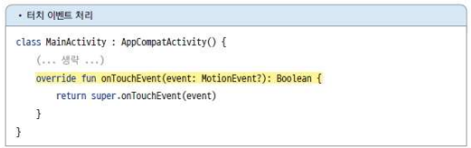
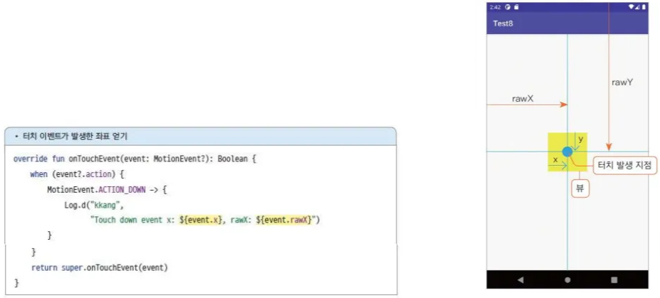
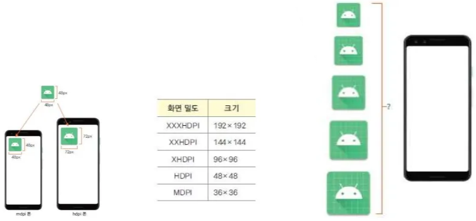
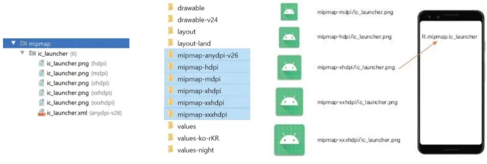
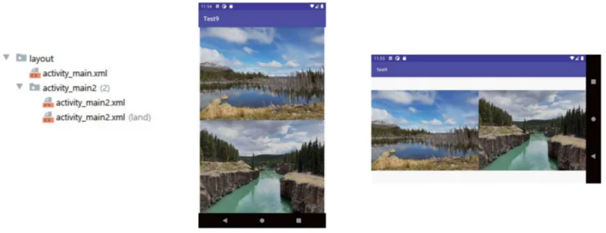
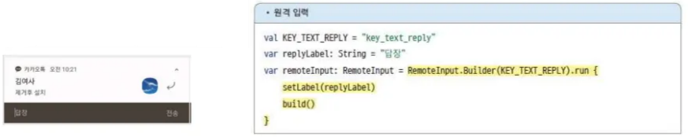

# 3. 앱의 기본 기능 구현하기 - (2)

# 사용자 이벤트 처리하기

## 1) 터치와 키 이벤트

### 터치 이벤트

- 터치 이벤트의 콜백 함수인 **`onTouchEvent()`**를 재정의해서 선언 (override)
(콜백 함수 : 어떤 이벤트가 발생하거나 시점에 도달했을 때 시스템에서 자동으로 호출하는 함수)
- 매개변수는 MotionEvent 객체이며, 이 객체에 터치의 종류와 발생 지점(좌푯값)이 담김
    
    
    
- 터치 이벤트의 종류
    - ACTION_DOWN : 화면을 손가락으로 누른 순간의 이벤트
    - ACTION_UP : 화면에서 손가락을 떼는 순간의 이벤트
    - ACTION_MOVE : 화면을 손가락으로 누른 채로 이동하는 순간의 이벤트
    
    
    
    화면을 눌렀다가 떼면 onTouchEvent함수는 2번 호출됨
    
- 터치 이벤트 발생 좌표 얻기
    - onTouchEvent() 함수의 매개변수인 MotionEvent 객체로 획득
        - x : 이벤트가 발생한 뷰의 X 좌표
        - y : 이벤트가 발생한 뷰의 Y 좌표
        - rawX : 화면의 X 좌표
        - rawY : 화면의 Y 좌표



### 키 이벤트

- 사용자가 폰의 키를 누르는 순간에 발생
- 콜백 함수 재정의
    - onKeyDown : 키를 누른 순간의 이벤트
    - onKeyUp : 키를 떼는 순간의 이벤트
    - onKeyLongPress : 키를 오래 누르는 순간의 이벤트
    
    
    
- 첫 번째 매개변수는 키의 코드이며 이 값으로 사용자가 어떤 키를 눌렀는지 식별
    
    
    
- 키 이벤트가 발생하는 키는 폰에서 제공하는 소프트 키보드의 키를 의미하지 않음 (자판)
- 안드로이드 시스템 버튼도 키로 취급하므로 이 버튼의 이벤트를 처리 (뒤로가기, 볼륨)
(but, 전원/홈/오버뷰 버튼 해당 X)
- 뒤로가기 버튼 이벤트에는 앞에서 살펴본 onKeyDown()이나 onKeyUp() 함수를 이용할 수도 있지만 onBackPressed() 함수를 이용할 수도 있음
    
    
    

## 2) 뷰 이벤트

### 뷰 이벤트의 처리 구조

- 뷰 이벤트 처리는 **이벤트 소스**와 **이벤트 핸들러**로 역할이 나뉘며 이 둘을 **리스너**로 연결해야 이벤트를 처리할 수 있음
    - 이벤트 소스 : 이벤트가 발생한 객체
    - 이벤트 핸들러 : 이벤트 발생 시 실행할 로직이 구현된 객체
    - 리스너 : 이벤트 소스와 이벤트 핸들러를 연결해 주는 함수
    
    
    
- 체크박스의 체크 상태 변경 이벤트 처리
    - 대부분 이벤트 핸들러는 이름 형식이 OnXXXListener인 인터페이스를 구현해서 만듦
        - OnClickListener, OnLongClickListener, OnItemClickListener 등
    
    
    
- 위 코드는 인터페이스를 구현한 object 클래스를 이벤트 핸들러로 만들었지만, 
액티비티 자체에서 인터페이스를 구현할 수도 있음
    
    
    
- 또한, 이벤트 핸들러를 별도의 클래스로 만들어 처리할 수도 있으며 코틀린의 SAM 기법 이용 가능
*SAM(single abstract method) : 코틀린에서 자바 인터페이스를 간단하게 사용하기 위해 제공


### 클릭과 롱클릭 이벤트 처리

- ClickEvent, LongClickEvent는 뷰의 최상위 클래스인 View에 정의된 이벤트
    - open fun setOnClickListener(l: View.OnClickListener?): Unit
    - open fun setOnLongClickListener(l: View.OnLongClickListener?): Unit
    (반환값이 Boolean이므로 람다 함수의 마지막 줄에 true/false 반환 필수)
    
    
    

## 3) 시계 앱의 스톱워치 기능 만들기

### 1단계. 새 모듈 생성하기

- Ch8_Event 이름으로 새로운 모듈 생성

### 2단계. 그래들 설정하기


```kotlin
buildFeatures {
        viewBinding {
            enable = true
        }
    }
```

### 3단계. 둥근 버튼 만들기

- [res → drawable] 디렉터리를 마우스 오른쪽 버튼으로 눌러
[New → Drawable Resource File] 메뉴를 선택 → File name에 rount_button → ok
- round_button.xml 파일 코드
    
    ```xml
    <?xml version="1.0" encoding="utf-8"?>
    <shape xmlns:android="http://schemas.android.com/apk/res/android"
        android:padding="10dp"
        android:shape="rectangle">
        <solid android:color="#6666FF"></solid>
        <corners
            android:bottomLeftRadius="30dp"
            android:bottomRightRadius="30dp"
            android:topLeftRadius="30dp"
            android:topRightRadius="30dp"></corners>
    </shape>
    ```
    

### 4단계. 앱 화면 구성하기

- activity_main.xml 파일 코드
    
    ```xml
    <?xml version="1.0" encoding="utf-8"?>
    <RelativeLayout xmlns:android="http://schemas.android.com/apk/res/android"
        android:layout_width="match_parent"
        android:layout_height="match_parent">
    
        <Chronometer
            android:id="@+id/chronometer"
            android:layout_width="match_parent"
            android:layout_height="wrap_content"
            android:layout_marginTop="100dp"
            android:gravity="center_horizontal"
            android:textSize="60dp" />
    
        <LinearLayout
            android:layout_width="match_parent"
            android:layout_height="wrap_content"
            android:layout_alignParentBottom="true"
            android:layout_marginBottom="70dp"
            android:gravity="center_horizontal"
            android:orientation="horizontal">
    
            <Button
                android:id="@+id/startButton"
                android:layout_width="100dp"
                android:layout_height="wrap_content"
                android:background="@drawable/round_button"
                android:text="Start"
                android:textColor="#FFFFFF"
                android:textStyle="bold" />
    
            <Button
                android:id="@+id/stopButton"
                android:layout_width="100dp"
                android:layout_height="wrap_content"
                android:layout_marginLeft="25dp"
                android:background="@drawable/round_button"
                android:enabled="false"
                android:text="Stop"
                android:textColor="#FFFFFF"
                android:textStyle="bold" />
    
            <Button
                android:id="@+id/resetButton"
                android:layout_width="100dp"
                android:layout_height="wrap_content"
                android:layout_marginLeft="25dp"
                android:background="@drawable/round_button"
                android:enabled="false"
                android:text="Reset"
                android:textColor="#FFFFFF"
                android:textStyle="bold" />
        </LinearLayout>
    </RelativeLayout>
    ```
    

### 5단계. 메인 액티비티 작성하기

- MainActivity.kt 파일 코드
    
    ```kotlin
    package com.example.ch8_event
    
    import android.os.Bundle
    import android.os.SystemClock
    import android.view.KeyEvent
    import android.widget.Toast
    import androidx.appcompat.app.AppCompatActivity
    import com.example.ch8_event.databinding.ActivityMainBinding
    
    class MainActivity : AppCompatActivity() {
        // 뒤로가기 버튼을 누른 시각을 저장하는 속성
        var initTime = 0L
        // 멈춘 시각을 저장하는 속성
        var pauseTime = 0L
        override fun onCreate(savedInstanceState: Bundle?) {
            super.onCreate(savedInstanceState)
            val binding = ActivityMainBinding.inflate(layoutInflater)
            setContentView(binding.root)
            binding.startButton.setOnClickListener {
                binding.chronometer.base = SystemClock.elapsedRealtime() + pauseTime
                binding.chronometer.start()
                // 버튼 표시 여부 조정
                binding.stopButton.isEnabled = true
                binding.resetButton.isEnabled = true
                binding.startButton.isEnabled = false
            }
            binding.stopButton.setOnClickListener {
                pauseTime = binding.chronometer.base - SystemClock.elapsedRealtime()
                binding.chronometer.stop()
                binding.stopButton.isEnabled = false
                binding.resetButton.isEnabled = true
                binding.startButton.isEnabled = true
            }
            binding.resetButton.setOnClickListener {
                pauseTime = 0L
                binding.chronometer.base = SystemClock.elapsedRealtime()
                binding.chronometer.stop()
                binding.stopButton.isEnabled = false
                binding.resetButton.isEnabled = false
                binding.startButton.isEnabled = true
            }
        }
        // 뒤로가기 버튼 이벤트 핸들러
        override fun onKeyDown(keyCode: Int, event: KeyEvent?): Boolean {
            // 뒤로가기 버튼을 눌렀을 때 처리
            if (keyCode === KeyEvent.KEYCODE_BACK) {
                // 뒤로가기 버튼을 처음 눌렀거나 누른 지 3초가 지났을 때 처리
                if (System.currentTimeMillis() - initTime > 3000) {
                    Toast.makeText(this, "종료하려면 한 번 더 누르세요!!",
                    Toast.LENGTH_SHORT).show()
                    initTime = System.currentTimeMillis()
                    return true
                }
            }
            return super.onKeyDown(keyCode, event)
        }
    }
    ```
    

### 6단계. 앱 실행하기


# 리소스 활용하기

## 1) 리소스의 종류와 특징

### 앱 리소스 사용하기

- 앱 리소스란 개발자가 직접 추가한 리소스를 의미
- 모듈 생성 시 자동으로 res 폴더 안에 drawable, layout, mipmap, values 디렉터리 생성
- 리소스 디렉터리명은 고정, 하위 디렉터리 생성 불
- 리소스 파일 명은 values에 추가하는 파일을 제외하고는 모두 자바의 이름 작성 규칙 준수
    - 알파벳 대문자를 사용할 수 없음
    
    
    
- 레이아웃 리소스 ― layout 디렉터리
- 이미지 리소스 ― drawable 디렉터리
    - 이미지는 PNG, JPG, GIF, 9.PNG 파일
    - XML로 작성한 이미지도 가능
    
    
    
    - XML 이미지를 만들 때 사용하는 태그
    
    
    
- 실행 아이콘 리소스 ― mipmap 디렉터리
- 값 리소스 ― values 디렉터리
    - 문자열, 색상, 크기, 스타일, 배열 등의 값을 XML로 저장
    - values 디렉터리의 리소스 파일은 파일명이 R인 파일에 식별자로 등록되지 않고, 
    리소스 파일에 값을 지정한 태그의 name 속성값이 등록
    - 따라서 values 폴더 안의 파일명은 권장일 뿐 개발자가 자유롭게 정할 수 있음 (대문자 가능)
    
    
    
    
    
    - 스타일 리소스는 style 태그로 등록
        - 스타일 속성은 뷰에 설정되는 여러 속성을 스타일에 등록하여 한꺼번에 적용 (재사용)
        - 스타일을 정의할 때 다른 스타일을 상속받아 재정의 가능 (`parent` 속성 사용)
        
        
        
- 색상 리소스 ― color 디렉터리
    - color 디렉터리의 리소스는 특정 뷰의 상태를 표현하고 그 상태에 적용되는 색상을 등록
    - 예를 들어 버튼을 눌렀을 때와 누르지 않았을 때의 색상 등록 
    (상태에 따른 색을 하나의 XML에 등록하면 편리)
    
    
    
- 글꼴 리소스 ― font 디렉터리
    - font 디렉터리는 글꼴 리소스를 저장
    - TTF나 OTF 파일 저장
    
    
    

### 플랫폼 리소스 사용하기

- 안드로이드 플랫폼이 제공하는 리소스 (Packages의 Libraries에서 확인 가능)
- android.R이라는 플랫폼 라이브러리의 R 파일에 등록된 식별자로 이용
- XML에서 사용 방법 : **`@android:drawable/save`**


## 2) 리소스 조건 설정

### 리소스 조건 설정

- 리소스를 특정 환경에서만 적용되도록 설정
- 실행 아이콘을 48X48px 크기로 준비했을 때, mdpi기기에 설치하면 선명하지만
hdpi에 설치하면 아이콘이 72X72px로 늘려서 출력됨
(dpi : 기기의 화면 밀도, 화면의 크기를 나타내는 단위)
- 보통 이미지를 크기 별로 5개씩 준비함
- 기기별 실행 아이콘 크기



- 리소스 조건 설정 방법
    - 아이콘의 파일명을 똑같이 지정
    - 이름이 같은 파일을 디렉터리를 구분하여 담기
    - 리소스 디렉터리 이름에서 붙임표(-) 뒤의 단어가 리소스의 조건
        - mipmap-mdpi 디렉터리는 mdpi라는 조건
    - 플랫폼이 알아서 res 디렉터리 아래에 mipmap 디렉터리를 여러 개 만듦
    
    
    
- 리소스 디렉터리 명에 지정할 수 있는 조건
    - 하나의 디렉터리에 여러 조건을 지정해도 됨 (순서 중요, 표의 순서대로 작성)
    - 어떤 리소스 디렉터리에 적용할 지는 개발자의 선택
    
    
    
    
    
    
    

### 화면 회전에 대응하기

- 방향에 따라 화면을 다르게 제공
- 리소스 조건으로 설정하여 처리
- 특정 조건을 명시하지 않으면 기본값 (세로 방향일 때 적용)
    
    
    

### 국제 언어 제공하기

- 리소스 문자열을 각국 언어로 제공 (리소스 조건으로 설정)
- 파일을 여러 개 만들어서 각 언어에 맞는 리소스 문자열을 담고, 어느 XML 파일을 적용해야 
하는지를 리소스 디렉터리명으로 지정
- string 태그의 name 값이 똑같아야 함
    
    
    

## 3) 폰 크기의 호환성

### 논리적인 단위 알아보기

- dpi는 dots per inch의 줄임말로 1인치 안에 있는 도트의 개수를 의미
- 물리적인 단위로 지정하면 시스템의 도움을 받을 수 없음
- 크기 지정에 사용할 수 있는 단위 (논리적인 단위인 dp, sp 권장)
    - dp(dip: density-independent pixels) : 스크린의 물리적 밀도에 기반을 둔 단위
    - sp(sip: scale-independent pixels) : dp와 유사하며 글꼴 크기에 적용
    - pt(points) : 스크린 크기의 1/72을 1pt로 함
    - px : 픽셀
    - mm : 밀리미터
    - in : 인치
- mdpi 폰을 기준으로 크기를 조정하며, 이 폰에서 1dp는 1px임
- xxhdpi 폰은 개발자가 지정한 크기보다 3배 정도 크게 출력


### 화면 정보 가져오기

- API레벨 30 이전 버전에서는 DisplayMetrics로 크기 정보 가져오기
- API레벨 30 버전부터는 이 방법을 지원하지 않고(deprecation), WindowMetrics를 이용
    - Build.VERSION.SDK_INT는 앱이 실행되는 기기의 버전 값
    - Build.VERSION_CODES.R은 안드로이드 11버전, 즉 API레벨 30을 의미
    
    
    

## 4) 메신저 앱의 인트로 화면 만들기

### 1단계. 새 모듈 생성하기

- Ch9_Resource 이름으로 새로운 모듈 생성

### 2단계. 리소스 파일 준비하기

- intro.png 파일 drawable 디렉터리에 복사
- round_button.xml 파일 코드
    
    ```xml
    <?xml version="1.0" encoding="utf-8"?>
    <shape xmlns:android="http://schemas.android.com/apk/res/android"
        android:shape="rectangle" android:padding = "10dp">
        <solid android:color="#0066FF"></solid>
        <corners
            android:bottomLeftRadius="15dp"
            android:bottomRightRadius="15dp"
            android:topLeftRadius="15dp"
            android:topRightRadius="15dp"></corners>
    </shape>
    ```
    

### 3단계. 언어별 문자열 리소스 작성하기

- strings.xml 파일 코드
    
    ```xml
    <resources>
        <string name="app_name">Ch9_Resource</string>
        <string name="intro_main">
        Find your phone contacts on Messenger
        </string>
        <string name="intro_detail">
        Continuously uploading your contacts helps Facebook and Messenger suggest connections
        and provide and improve ads for you and others, and offer a better service.
        </string>
        <string name="intro_more">Learn More</string>
        <string name="intro_button">TRUN ON</string>
        <string name="intro_delay">NOT NOW</string>
    </resources>
    ```
    
- values-ko-rKR/values.xml 파일 생성 및 코드
    - values 디렉터리에서 마우스 오른쪽 버튼 클릭 → New → Values Resource File 클릭
    - File name에 strings.xml 입력 → Available qualifiers에서 Locale 선택 → >> 버튼 클릭
    - Language에서 ko:korean 선택 → Specific Region Only에서 KR: South Korea 선택 → ok
    
    
    
    ```xml
    <?xml version="1.0" encoding="utf-8"?>
    <resources>
        <string name="app_name">Ch9_Resource</string>
        <string name="intro_main">
        Messenger에서 휴대폰 연락처에 있는 사람들을 찾아보세요
        </string>
        <string name="intro_detail">
        연락처를 계속 업로드하면 Facebook 및 Messenger에서 연결된 연락처를 추천하고 회원님과 다른
        사람들에게 더욱 관련성 높은 광고를 표시하여 더 나은 서비스를 제공하는 데 도움이 됩니다.
        </string>
        <string name="intro_more">더 알아보기</string>
        <string name="intro_button">설정</string>
        <string name="intro_delay">나중에 하기</string>
    </resources>
    ```
    

### 4단계. 세로 방향 화면 구성하기

- activity_main.xml 파일 코드
    
    ```xml
    <?xml version="1.0" encoding="utf-8"?>
    <RelativeLayout xmlns:android="http://schemas.android.com/apk/res/android"
        android:layout_width="match_parent"
        android:layout_height="match_parent"
        android:padding="20dp">
    
        <ImageView
            android:id="@+id/imageView"
            android:layout_width="wrap_content"
            android:layout_height="wrap_content"
            android:layout_centerHorizontal="true"
            android:src="@drawable/intro" />
    
        <TextView
            android:id="@+id/mainTextView"
            android:layout_width="match_parent"
            android:layout_height="wrap_content"
            android:layout_below="@id/imageView"
            android:layout_centerHorizontal="true"
            android:layout_marginTop="20dp"
            android:gravity="center_horizontal"
            android:text="@string/intro_main"
            android:textSize="20dp"
            android:textStyle="bold" />
    
        <TextView
            android:id="@+id/detailTextView"
            android:layout_width="match_parent"
            android:layout_height="wrap_content"
            android:layout_below="@id/mainTextView"
            android:layout_centerHorizontal="true"
            android:layout_marginTop="20dp"
            android:gravity="center_horizontal"
            android:text="@string/intro_detail" />
    
        <TextView
            android:id="@+id/delayTextView"
            android:layout_width="match_parent"
            android:layout_height="wrap_content"
            android:layout_alignParentBottom="true"
            android:layout_centerHorizontal="true"
            android:layout_marginBottom="20dp"
            android:gravity="center_horizontal"
            android:text="@string/intro_delay" />
    
        <Button
            android:layout_width="match_parent"
            android:layout_height="wrap_content"
            android:layout_above="@id/delayTextView"
            android:layout_centerHorizontal="true"
            android:layout_marginBottom="20dp"
            android:background="@drawable/round_button"
            android:text="@string/intro_button"
            android:textColor="#FFFFFF" />
    </RelativeLayout>
    ```
    

### 5단계. 기로방향 화면 구성하기

- layout-land/activity_main.xml 파일 생성 및 코드
    - layout 디렉터리에서 마우스 오른쪽 버튼 클릭 → New → Layout Resource File 클릭
    - File name에 activity_main 입력 → Available qualifiers에서 Orientation 선택 → >> 버튼 클릭
    - Screen orientation에서 Landscape 선택 → ok
    
    
    
    ```xml
    <?xml version="1.0" encoding="utf-8"?>
    <RelativeLayout xmlns:android="http://schemas.android.com/apk/res/android"
        android:layout_width="match_parent"
        android:layout_height="match_parent"
        android:padding="20dp">
    
        <TextView
            android:id="@+id/mainTextView"
            android:layout_width="match_parent"
            android:layout_height="wrap_content"
            android:layout_centerHorizontal="true"
            android:layout_marginTop="20dp"
            android:gravity="center_horizontal"
            android:text="@string/intro_main"
            android:textSize="20dp"
            android:textStyle="bold" />
    
        <TextView
            android:id="@+id/detailTextView"
            android:layout_width="match_parent"
            android:layout_height="wrap_content"
            android:layout_below="@id/mainTextView"
            android:layout_centerHorizontal="true"
            android:layout_marginTop="20dp"
            android:gravity="center_horizontal"
            android:text="@string/intro_detail" />
    
        <TextView
            android:id="@+id/delayTextView"
            android:layout_width="match_parent"
            android:layout_height="wrap_content"
            android:layout_alignParentBottom="true"
            android:layout_centerHorizontal="true"
            android:layout_marginBottom="20dp"
            android:gravity="center_horizontal"
            android:text="@string/intro_delay" />
    
        <Button
            android:layout_width="match_parent"
            android:layout_height="wrap_content"
            android:layout_above="@id/delayTextView"
            android:layout_centerHorizontal="true"
            android:layout_marginBottom="20dp"
            android:background="@drawable/round_button"
            android:text="@string/intro_button"
            android:textColor="#FFFFFF" />
    </RelativeLayout>
    ```
    

### 6단계. 앱 실행하기

- 기기의 언어를 한국어로 설정하기
    - Settings 앱 실행 → System → Languages & Input → Languages → Add a language → 한국어 → 대한민국 → 상위로 드래그 → 앱 다시 실행


# 다이얼로그와 알림 이용하기

## 1) API 레벨 호환성 고려하기

- 앱은 31 버전의 API로 개발하지만 21 버전 기기에서도 오류가 발생하지 않고 동작해야 함
- minSdk 설정값보다 상위 버전에서 제공하는 API를 사용한다면 호환성을 고려
    
    
    
- **`@RequiresApi`** 애너테이션이나 **`@TargetApi`** 애너테이션을 이용
- 안드로이드 스튜디오에서 오류를 무시하는 설정
    
    
    
- 애너테이션은 안스에서 오류를 무시하는 설정일 뿐, 앱이 실행될 때 API 레벨 호환성 문제를 막으려면 직접 코드로 처리
    
    
    

## 2) 퍼미션 설정하기

### 퍼미션이란?

- 앱의 특정 기능에 부여하는 접근 권한을 말함
- 개발하는 앱이 다른 앱이나 안드로이드 시스템에서 보호하는 특정 기능을 이용할 때 퍼미션 사용
- 만든 기능을 다른 앱에서 사용할 수 없도록 보호하고 권한을 얻은 앱에서만 허용하고 싶을 때 설정

### 퍼미션 설정과 사용 설정

- A 앱의 컴포넌트를 B 앱에서 사용하는 상황
- 만약 A 앱의 컴포넌트에 퍼미션을 설정하면 B 앱에서 연동할 때 문제가 발생
    
    
    
- A 앱의 매니페스트 파일에 <permission> 태그로 퍼미션을 설정
- B 앱의 매니페스트 파일에 <uses-permission> 태그로 해당 퍼미션을 이용하겠다고 설정
- **`<permission>`** : 기능을 보호하려는 앱의 매니페스트 파일에 설정
- **`<uses-permission>`** : 퍼미션으로 보호된 기능을 사용하려는 앱의 매니페스트 파일에 설정
    
    
    
- <permission> 태그와 속성
    - name : 퍼미션의 이름, 식별자 역할
    - label, description : 퍼미션을 설명, 퍼미션을 이용하는 외부 앱에서 권한 인증 화면에 출력
    - protectionLevel : 보호 수준 (normal, dangerous, signature를 주로 사용)
        - normal : 낮은 수준의 보호, 사용자에게 권한 허용을 요청하지 않아도 됨
        - dangerous : 높은 수준의 보호, 사용자에게 권한 허용을 요청해야 함
        - signature : 같은 키로 인증한 앱만 실행
        - signatureOrSystem : 안드로이드 시스템 앱이거나 같은 키로 인증한 앱만 실행
    
    
    

- <uses-permission>을 2개 설정했다고 가정 (네크워크 접근, 사용자 위치 추적)
    - ACCESS_NETWORK_STATE는 보호 수준이 normal
    - ACCESS_FINE_LOCATION은 보호 수준이 dangerous
    - 사용하는 것으로 설정했으나 설치 후 앱의 권한 화면을 보면 보호 수준이 dangerous로 설정된 퍼미션만 나옴
    
    
    


- 매니페스트 파일에 permission을 설정했다고 해서 컴포넌트가 보호되지 않음
<permission>을 설정한 다음 이 퍼미션으로 보호하려는 컴포넌트에 적용해야 함
    - `android:permission` 속성 이용
    → 해당 컴포넌트는 com.example.TEST_PERMISSION에 의해 보호
    
    
    
    - 컴포넌트를 이용하는 곳에서는 매니페스트 파일에 <uses-permission>을 선언해 줘야 
    정상으로 실행
    
    
    
- 시스템에서 보호하는 기능을 사용할 때도 매니페스트 파일에 퍼미션 사용 설정 필요
    - ACCESS_FINE_LOCATION : 위치 정보 접근
    - ACCESS_NETWORK_STATE : 네트워크 정보 접근
    - ACCESS_WIFI_STATE : 와이파이 네트워크 정보 접근
    - BATTERY_STATS : 배터리 정보 접근
    - BLUETOOTH : 블루투스 장치에 연결
    - BLUETOOTH_ADMIN : 블루투스 장치를 검색하고 페어링
    - CAMERA : 카메라 장치에 접근
    - INTERNET : 네트워크 연결
    - READ_EXTERNAL_STORAGE : 외부 저장소에서 파일 읽기
    - WRITE_EXTERNAL_STORAGE : 외부 저장소에 파일 쓰기
    - READ_PHONE_STATE : 전화기 정보 접근
    - SEND_SMS : 문자 메시지 발신
    - RECEIVE_SMS : 문자 메시지 수신
    - RECEIVE_BOOT_COMPLETED : 부팅 완료 시 실행
    - VIBRATE : 진동 울리기

### 퍼미션 허용 확인

- API 레벨 23 버전부터 허가제로 변경
- <uses-permission>으로 선언했더라도 사용자가 권한 화면에서 이를 거부할 수 있게 되었음
- 앱을 실행할 때 사용자가 퍼미션을 거부했는지 확인하고, 만약 거부했으면 다시 퍼미션을 허용해 달라고 요청해야 함


- 퍼미션을 허용했는지 확인하려면 **`checkSelfPermission()`** 함수를 이용
- 결괏값은 다음 중 하나의 상수로 전달
    - PackageManager.PERMISSION_GRANTED : 권한을 허용한 경우
    - PackageManager.PERMISSION_DENIED : 권한을 거부한 경우
    
    
    
- 거부한 상태라면 사용자에게 해당 퍼미션을 허용해 달라고 요청해야 함
- **`ActivityResultLauncher`**를 이용 (액티비티에서 결과를 돌려받아야 할 때 사용)
- ActivityResultLauncher 객체는 **`registerForActivityResult()`** 함수를 호출해서 만듦
    - 첫 번째 매개변수 : 어떤 요청인지를 나타내는 ActivityResultContract 타입 객체
    (다양한 요청에 대응하는 서브 클래스들 존재, 다른 액티비티를 실행하고 결과 받을 때는 StartActivityForResult, 퍼미션 허용을 요청할 때는 RequestPermission 사용)
    - 두 번째 매개변수 : 결과를 받았을 때 호출되는 콜백
- 필요한 곳에서 ActivityResultLauncher 객체의 launch() 함수를 호출하여 요청을 실행
    - 요청 결과는 두 번재 매개변수로 등록한 콜백으로 전달됨


## 3) 다양한 다이얼로그

### 다이얼로그란?

- 사용자와 상호 작용하는 대화 상자

### 토스트 메시지 띄우기

- 토스트는 화면 아래쪽에 잠깐 보였다가 사라지는 문자열

- 토스트는 Toast의 **`makeText()`** 함수로 만듦
    - open static fun makeText(context: Context!, text: CharSequence!, duration: Int): Toast!
    - open static fun makeText(context: Context!, resId: Int, duration: Int): Toast!
    - 두 번째 배개변수는 출력할 문자열
    - 세 번째 매개변수는 토스트가 화면에 출력되는 시간
        - val LENGTH_LONG: Int (5초)
        - val LENGTH_SHORT: Int (3초)
    
    
    


- makeText() 함수로 만든 토스트는 show() 함수로 화면에 출력함
- 위 함수가 아닌 다음의 세터 함수로 만들 수도 있음
    - open fun setDuration(duration: Int): Unit
    - open fun setGravity(gravity: Int, xOffset: Int, yOffset: Int): Unit
    - open fun setMargin(hofizontalMargin: Float, verticalMargin: Float): Unit
    - open fun setText(resId: Int)L Unit
- setDuration, setText 함수를 이용하면 문자열이나 화면에 보이는 시간을 설정할 수 있음
setGravity, setMargin 함수를 이용하면 토스트가 뜨는 위치를 정할 수 있음
- 토스트가 화면에 보이거나 사라지는 순간을 콜백으로 감지해 특정 로직을 수행하게 할 수도 있음
    - 콜백 기능은 API 레벨 30 버전에서 추가됨
    - 토스트의 콜백을 등록하려면 Toast.Callback 타입의 객체를 토스트 객체의 addCallback() 함수로 등록해주면 됨
    
    
    

### 날짜 또는 시간 입력받기

- 날짜를 입력받을 때는 DatePickerDialog를, 시간을 입력받을 때는 TimePickerDialog를 사용
- 데이트 피커 다이얼로그 생성자
    - DatePickerDialog(context: Context, listener: DatePickerDialog.OnDateSetListener?, year: Int, month: Int, dayOfMonth: Int)
    - 두 번째 매개변수로 DatePickerDialog.OnDateSetListener 구현 객체를 등록하면 사용자가 설정한 날짜를 콜백 함수로 얻을 수 있음
    - 나머지 Int 타입 매개변수는 처음에 보이는 날짜 (month 값음 0~11로 0은 1월을 의미)
    
    
    
- 타임 피커 다이얼로그 생산자
    - 쌰ㅡㄷPickerDialog(context: Context!, listener: TimePickerDialog.OnTimeSetListener!, hourOfDay: Int, minute: Int, is24HourView: Boolean)
    - 두 번째 매개변수로 DatePickerDialog.OnDateSetListener 구현 객체를 등록하면 사용자가 설정한 시간을 얻을 수 있음
    - 나머지 Int 타입 매개변수는 처음에 보일 시간
    - 마지막 매개변수로 시간을 24시간과 12시간 형태 중 어떤 것으로 출력할 지 지정
    (false는 12시간 형태로 오전/오후를 선택하는 부분이 보임)
    
    
    

### 알림 창 띄우기

- 다이얼로그의 기본은 AlertDialog
- 크게 3가지 제목, 내용, 버튼 영역으로 구분 (항상 3가지 영역이 보이는 것은 아님)
- **`AlertDialog.Builder`**를 제공하므로 이 빌더를 이용해 알림 창을 만듦 (객체 직접 생성 불가)
생성하고 빌더의 세터 함수로 알림 창의 정보를 지정
    - open fun setIcon(iconId: Int): AlertDialog.Builder!
    - open fun setTitle(title: CharSequence!): AlertDialog.Builder!
    - open fun setMessage(message: CharSequence!): AlertDialog.Builder!
- 알림 창에 버튼을 지정하는 함수
    - open fun setPositiveButton(text: CharSequence!, listener: DialogInterface.OnClick Listener!): AlertDialog.Builder!
    - open fun setNegativeButton(text: CharSequence!, listener: DialogInterface.OnClick Listener!): AlertDialog.Builder!
    - open fun setNeutralButton(text: CharSequence!, listener: DialogInterface.OnClick Listener!): AlertDialog.Builder!
    - 각 함수의 첫 번째 매개변수는 버튼의 문자열, 두 번째 매개변수는 사용자가 클릭했을 때 처리할 이벤트 핸들러(처리할 내용이 없다면 null 대입, 창은 닫힘)
    - 알림 창의 버튼은 최대 3개까지 추가할 수 있음
    
    
    
    - 버튼 함수를 3가지로 구분하는 이유는 이벤트 핸들러에서 어떤 버튼이 클릭됐는지 구분하기 위함 (각 이벤트에 해당하는 핸들러를 따로 만들 수도 있으나, 한 핸들러에서 모두 처리 가능)
        
        ```kotlin
        val eventHandler = object : DialogInterface.OnClickListener {
            override fun onClick(p0: DialogInterface?, p1: Int) {
                if (p1 == DialogInterface.BUTTON_POSITIVE) {
                    Log.d("dd", "positive btn click")
                } else if (p1 == DialogInterface.BUTTON_NEGATIVE) {
                    Log.d("dd", "negative btn click")
                }
            }
        }
        
        setPositiveButton("OK", eventHandler)
        setNegativeButton("Cancel", eventHandler)
        ```
        
- setMessage() 말고 목록을 제공하고 이 중 하나를 선택받는 알림 창을 만들고자 한다면 
setItems(), setMultiChoiceItems(), setSingleChoiceItems() 함수를 이용
    - open fun setItems(items: Array<CharSequence!>!, listener: DialogInterface.OnClickListener!): AlertDialog.Builder!
    - open fun setMultiChoiceItems(items: Array<CharSequence!>!, checkedItems: BooleanArray!, listener: DialogInterface.OnMultiChoiceClickListener!): AlertDialog.Builder!
    - open fun setSingleChoiceItems(items: Array<CharSequence!>!, checkedItem: Int, listener: DialogInterface.OnClickListener!): AlertDialog.Builder!
    - 각 함수에서 첫 번째 매개변수는 배열 정보
    - setItems()의 두 번째 매개변수는 항목을 선택할 때의 이벤트 핸들러이며, 
    사용자가 항목을 선택하면 onClick 함수가 자동으로 호출됨 → 선택한 항목의 인덱스는 onClick 함수의 두 번째 매개변수로 전달됨
        
        
        
    - setMultiChoiceItems() 함수는 다중 선택을 위한 체크 박스가 함께 출력되는 항목을 만듦,
    두 번째 매개변수로 처음 체크 상태를 지정함, 
    세 번째 매개변수는 항목을 선택할 때의 이벤트 핸들러이며, 사용자가 항목을 선택하면 onClick 함수가 자동으로 호출됨 → 선택한 항목의 인덱스는 onClick 함수의 두 번째 매개변수로 전달되며 세 번째 매개변수로 체크 상태가 전달
        
        
        
    - setSingleChoiceItems() 함수는 하나만 선택할 수 있는 라디오 버튼으로 구성된 항목을 만듦,
    두 번째 매개변수로 처음 선택할 항목을 지정함
        
        
        
- 알림 창의 제목, 내용, 버튼을 구성하는 함수 외에 속성을 설정하는 함수를 사용할 수 있음
    - open fun setCancelable(cancelable: Boolean): AlertDialog.Builder!
    - open fun setCanceledOnTouchOutside(cancel: Boolean): Unit
    - 두 함수 모두 사용자의 행동에 따라 알림 창을 닫을 것인지를 설정함
    - setCancelable() 함수는 사용자가 기기의 뒤로가기 버튼을 눌렀을 때
    - setCanceledOnTouchOutside() 함수는 알림 창의 바깥 영역을 터치했을 때 매개변수가 true이면 닫고 false이면 닫지 않음
    
    
    
    - setCancelable 함수는 AlertDialog.Vuilder 클래스 함수이고, 
    setCanceledOnTouchOutside 함수는 Dialog 클래스의 함수이므로 바깥에 작성

### 커스텀 다이얼로그 만들기

- 커스텀 다이얼로그도 AlertDialog를 이용
- LayoutInflater 클래스는 레이아웃 XML 파일을 코드에서 초기화(전개라고 표현)하는 기능을 제공
(초기화 = XML 파일에 선언한 뷰를 코드에서 이용하고자 생성하는 작업을 의미)
(객체를 생성해서 메모리에 할당해주는 작업)


<aside>


**레이아웃 XML 파일에 화면을 구성하고 액티비티에서 출력할 때 setContentView() 함수를 이용했는데, 굳이 LayoutInflater로 객체를 생성해야 하는 이유**

→ 액티비티의 화면을 구성하는 레이아웃 XML 파일이면 setContentView 함수 이용

→ 커스텀 다이얼로그를 위한 XML 파일뿐만 아니라, 리스트 뷰, 리사이클러 뷰의 항목 화면, 프래그먼트를 위한 XML 파일 등 액티비티의 화면을 목적으로 하지 않는 레이아웃 XML 파일을 많이 만듦 이때 LayoutInflater 이용

</aside>

- **LayoutInflater**로 레이아웃 XML 파일 ****초기화 작업
    - get SystemService() 함수로 LayoutInflater를 얻기
    - inflate() 함수를 호출하면서 초기화할 레이아웃 XML 파일 정보를 매개변수로 전달
    (위 함수의 반환 값은 초기화된 XML의 루트 태그에 해당하는 객체 ex. LinearLayout 객체 반환)
    
    
    
    - 뷰 바인딩 기법을 이용한다면 XML 초기화 코드를 조금 더 쉽게 작성
        - 초기화할 XML에 해당하는 바인딩 클래스의 inflate() 함수를 호출하면서 매개변수로 layoutInflater 객체를 전달만 해주면, 자동으로 초기화되고 루트 뷰 객체를 얻을 수 있음
    
    
    
- 커스텀 다이얼로그 만드는 방법
    - 다이얼로그를 구성하는 레이아웃 XML 파일 생성
    - 이 XML 파일을 LayoutInflater로 초기화해서 다이얼로그에 적용
    - AlertDialog의 setView() 함수에 매개변수로 뷰 객체를 전달하면 창의 내용 영역에 출력
    
    ```xml
    <?xml version="1.0" encoding="utf-8"?>
    <LinearLayout xmlns:android="http://schemas.android.com/apk/res/android"
        android:layout_width="match_parent"
        android:layout_height="match_parent"
        android:orientation="vertical">
        
        <EditText
            android:layout_width="match_parent"
            android:layout_height="wrap_content" />
        
        <RadioGroup
            android:layout_width="match_parent"
            android:layout_height="match_parent"
            android:orientation="horizontal">
            <RadioButton
                android:layout_width="wrap_content"
                android:layout_height="wrap_content"
                android:text="male" />
            <RadioButton
                android:layout_width="wrap_content"
                android:layout_height="wrap_content"
                android:text="female" />
        </RadioGroup>
    </LinearLayout>
    ```
    
    
    

## 4) 소리와 진동 알림

### 소리 알림

- 안드로이드 시스템은 알림(NOTIFICATION), 알람(ALARM), 벨소리(RINGTONE) 등의 소리를 제공하며 이 소리는RingtonManager로 얻을 수 있음
    
    
    
    1. RingtonManager.getDefaultUri() 함수를 이용해 식별값 얻기 (식별값은 Uri 객체)
    2. 얻은 값을 RingtonManager.getRingtone() 함수의 두 번째 매개변수로 전달하면 Ringtone 객체를 얻음
    3. 이 객체의 play() 함수를 호출하면 재생됨
- 앱에서 자체 음원을 준비해서 재생하는 방법
    - 음원 리소스 디렉터리는 res/raw에 등록
    - 음원을 재생하는 클래스는 MediaPlayer, start() 함수 호출로 재색
    
    
    

### 진동 알림

- 매니페스트 파일에 <uses-permission>으로 퍼미션 얻기
`<uses-permission android:name=”android.permission.VIBRATE” />`
- 진동은 Vibrator 클래스를 이용 (객체 얻는 방법)
    - 31 이전 버전에서는 VIBRATOR_SERVICE로 식별되는 시스템 서비스를 이용
    - 31 버전부터는 VIBRATOR_MANAGER_SERVICE로 식별되는 VibratorManager라는 시스템 서비스를 얻고 이 서비스에서 Vibrator를 이용
    
    
    
- 시간과 패턴을 지정해 진동 울리기 (API 레벨 1부터 제공하는 함수, 26부터 deprecated됨)
    - open fun vibrate(milliseconds: Long): Unit
    - open fun vibrate(pattern: LongArray!, repeat: Int): Unit
- 진동의 세기까지 지정해 진동 울리기 (API 레벨 26부터 제공하는 함수)
    - open fun vibrate(vibe: VibrationEffect!): Unit
    - VibrationEffect 객체로는 진동이 울리는 시간 이외에 진동의 세기까지 제어
    (진동 정보를 지정하는 다음 함수를 제공함)
    - open static fun createOneShot(milliseconds: Long, amplitude: Int): VibrationEffect!
        - 이 함수로 만든 VibrationEffect 객체를 vibrate() 함수에 대입하면 첫 번째 매개변수의 시간동안 진동이 울림 - 500이면 0.5초
        - 진동의 세기는 0~255 사이의 숫자로 표현
        (0으로 지정하면 진동 안 울림, 255는 기기에서 지원하는 가장 센 강도)
        VibrationEffect .DEFAULT_AMPLITUDE 처럼 상수를 지정해 기본 세기로 울리게 가능
    - open static fun createWaveform(timings: LongArray!, amplitudes: IntArray!, repeat: Int): VibrationEffect !
        - 반복해서 진동 울리는 함수
        - 첫 번째 매개변수는 진동이 울리는 시간 패턴의 배열
        - 두 번째 매개변수는 진동 세기 패턴의 배열
        - 세 번째 매개변수가 이 패턴의 반복 횟수
        
        
        

## 5) 알림 띄우기

### 알림 채널

- 상태 바에 앱의 정보를 출력하는 것을 알림 notification이라고 함
- NotificationChannel로 알림 채널을 만들고, 이 채널 정보를 대입해 Notificationcompat.Builder를 만든 다음, 이 빌더로 Notification 객체(알림 정보 저장)를 만듦.
이 Notification 객체를 NotificationManager의 notify() 함수에 대입하는 구조


- Notification을 만들려면 NotificationCompat.Builder가 필요
    - 26 버전 이전까지는 빌더를 만들 때 NotificationChannel 정보가 필요 없었음
    - 26 버전부터는 빌더를 만들 때 NotificationChannel을 만들고 이 채널의 식별값을 빌더의 생성자 매개변수에 지정해줘야 함
    - 빌더 생성자 - Builder(context: Context!, channelId: String!)
    - 앱의 알림을 채널로 구분하겠다는 의도 (채널 별로 알림 설정 가능)
- 알림 채널 생성자 - NotificationChannel(id: String!, name: CharSequence!, importance: Int)
    - 매개변수로 채널의 식별값과 설정 화면에 표시할 채널 이름을 문자열로 지정
    - 세 번째 매개변수는 이 채널에서 발생하는 알림의 중요도이며 다음의 상수로 지정
        
        
        
- 채널의 각종 정보는 함수나 프로퍼티로 설정
    - fun setDescription(description: String!): Unit: 채널의 설명 문자열
    - fun setShowBadge(showBadge: Boolean): Unit: 홈 화면의 아이콘에 배지 아이콘 출력 여부
    - fun setSound(sound: Uri!, audioAttributes: AudioAttributes!): Unit: 알림음 재생
    - fun enableLights(lights: Boolean): Unit: 불빛 표시 여부
    - fun setLightColor(argb: Int): Unit: 불빛이 표시된다면 불빛의 색상
    - fun enableVibration(vibration: Boolean): Unit: 진동을 울릴지 여부
    - fun setVibrationPattern(vibrationPattern: LongArray!): Unit: 진동을 울린다면 진동의 패턴
    
    
    

### 알림 객체

- 위에서 알림 빌더를 만들었으면, 이 빌더를 이용해 Notification 객체를 만들어야 함
- 이 객체에 출력할 이미지, 문자열 등의 정보를 담음
- 빌더의 세터 함수를 이용해 알림의 구성 정보 설정
    
    
    
- NotificationManager 클래스의 notify() 함수를 통해 알림을 띄움
    - 첫 번재 매개변수 값은 알림을 식별하는 데 사용하는 숫자 (개발자가 임의로 지정)
    - 이 식별값은 사용자 폰에 발생한 알림을 코드에서 취소할 때 사용
- cancel() 함수 이용, 매개변수로 취소할 알림의 식별값 전달
- 터치나 스와이프를 하더라도 알림이 사라지지 않게 하려면 빌더의 세터 함수로 지정
    - setAutoCancel(false)로 지정하면 알림을 터치할 때 이벤트는 발생하지만 사라지지 X
    - setOngoing(true)로 지정하면 사용자가 알림을 스와이프해도 사라지지 X
    - 위 두가지 모두 설정했다면, 코드에서 특정 순간에 cancel 함수로 취소해야 함
    
    
    

### 알림 구성

- 알림 터치 이벤트
    - 알림은 앱이 관할하는 화면이 아니라서, 터치 시 실행할 정보를 Notification 객체에 담아두고 실제 이벤트가 발생하면 객체에 등록된 이벤트 처리 내용을 시스템이 실행하는 구조로 처리
    - 알림을 터치하면 앱의 액티비티 또는 브로드캐스트 리시버를 실행해야 하는데,
    이를 실행하려면 인텐트(intent)를 이용해야 함
    (intent - 앱의 컴포넌트를 실행하는 데 필요한 정보)
    - 인텐트를 준비한 후 Notification 객체에 담아서 이벤트가 발생할 때 인텐트를 실행해 달라고 시스템에 의뢰
    - 이러한 의뢰는 PendingIntent 클래스 이용 (컴포넌트 별로 실행을 의뢰하는 함수 제공)
    - static fun getActivity(context: Context!, requestCode: Int, intent: Intent!, flags: Int): PendingIntent!
    - static fun getBroadcast(context: Context!, requestCode: Int, intent: Intent!, flags: Int): PendingIntent!
    - static fun getService(context: Context!, requestCode: Int, intent: Intent, flags: Int): PendingIntent!
    - 세 번째 매개변수에 intent 정보 등록, 네 번째 매개변수는 똑같은 알림 발생 시 처리 방법
        - FLAG_IMMUTABLE, FLAG_CANCEL_CURRENT, FLAG_MUTABLE, FLAG_NO_CREATE, FLAG_ONE_SHOW, FLAG_UPDATE_CURRENT 중 택 1
        - API 레벨 31 대상이라면 FLAG_MUTABLE, FLAG_IMMUTABLE 중 택 1
    - 터치 이벤트 등록은 빌더의 setContentIntent() 함수 이용
    
    
    
- 액션
    - 액션을 최대 3개까지 추가
    - 간단한 이벤트 처리 (알람 취소, 전화 수신, 거부 등)
    - 액션 등록 함수 (매개변수로 액션의 정보를 담는 Action 객체 전달)
        - open fun addAction(action: Notification.Action!): Notification.Builder
    - 액션 빌더 생성자 (Action 객체 생성)
        - Builder(icon: Int, title: CharSequence!, intent: PendingIntent!)
    - 액션 빌더 생성자에 아이콘 정보, 문자열, 클릭 시 이벤트를 위한 PendingIntent 객체 전달
    
    
    
- 원격 입력 **(추후 학습: 개정 2판, p.303)**
    - 알림에서 사용자 입력을 직접 받는 기법
    
    
    
- 프로그레스  **(추후 학습: 개정 2판, p.305)**
    - 진행 상황을 프로그레스에 바로 알려줌
    
    
    

### 알림 스타일 **(추후 학습: 개정 2판, p.306)**

- 큰 이미지 스타일
- 긴 텍스트 스타일
- 상자 스타일
- 메시지 스타일

## 6) 카카오톡 알림 만들기

### 1단계. 새 모듈 생성하기

- Ch10_Notification 이름으로 새로운 모듈 생성
- 뷰 바인딩 기법 추가 (번들 파일 내 android 부분)
    
    ```kotlin
    buildFeatures {
          viewBinding {
              enable = true
          }
      }
    ```
    

### 2단계. 파일 복사하기

- big.jpg, small.png, send.png 파일을 res/drawable 디렉터리에 복사
- layout/activity_main.xml 파일 코드
    
    ```xml
    <?xml version="1.0" encoding="utf-8"?>
    <LinearLayout xmlns:android="http://schemas.android.com/apk/res/android"
        android:layout_width="match_parent"
        android:layout_height="match_parent"
        android:orientation="vertical"
        android:gravity="center">
    
        <Button
            android:id="@+id/notificationButton"
            android:layout_width="wrap_content"
            android:layout_height="wrap_content"
            android:text="알림 발생"/>
    
    </LinearLayout>
    ```
    

### 3단계. 브로드캐스트 리시버 작성하기

- [New → Other → Broadcast Receiver]
- ReplyReceiver 라는 브로드캐스트 리시버 파일 코드
    
    ```kotlin
    package com.example.ch10_notification
    
    import android.app.NotificationManager
    import android.content.BroadcastReceiver
    import android.content.Context
    import android.content.Intent
    import android.util.Log
    import androidx.appcompat.app.AppCompatActivity
    import androidx.core.app.RemoteInput
    
    class ReplyReceiver : BroadcastReceiver() {
    
        override fun onReceive(context: Context, intent: Intent) {
            // 알림의 입력 글 획득
            val replyTxt = RemoteInput.getResultsFromIntent(intent)
                ?.getCharSequence("key_text_reply")
            Log.d("kkang", "replyTxt : $replyTxt")
            // 알림 취소
            val manager = context.getSystemService(
                AppCompatActivity.NOTIFICATION_SERVICE
            ) as NotificationManager
            manager.cancel(11)
        }
    }
    ```
    

### 4단계. 메인 액티비티 작성하기

- MainActivity.kt 파일 코드
    
    ```kotlin
    package com.example.ch10_notification
    
    import android.app.NotificationChannel
    import android.app.NotificationManager
    import android.app.PendingIntent
    import android.content.Intent
    import android.graphics.BitmapFactory
    import android.media.AudioAttributes
    import android.media.RingtoneManager
    import android.net.Uri
    import android.os.Build
    import android.os.Bundle
    import androidx.appcompat.app.AppCompatActivity
    import androidx.core.app.NotificationCompat
    import androidx.core.app.RemoteInput
    import com.example.ch10_notification.databinding.ActivityMainBinding
    
    class MainActivity : AppCompatActivity() {
        override fun onCreate(savedInstanceState: Bundle?) {
            super.onCreate(savedInstanceState)
            val binding = ActivityMainBinding.inflate(layoutInflater)
            setContentView(binding.root)
            binding.notificationButton.setOnClickListener {
                val manager = getSystemService(NOTIFICATION_SERVICE)
                        as NotificationManager
                val builder: NotificationCompat.Builder
                if (Build.VERSION.SDK_INT >= Build.VERSION_CODES.O) {
                    // 26 버전 이상
                    val channelId = "one-channel"
                    val channelName = "My Channel One"
                    val channel = NotificationChannel(
                        channelId,
                        channelName,
                        NotificationManager.IMPORTANCE_DEFAULT
                    ).apply {
                        // 채널에 다양한 정보 설정
                        description = "My Channel One EventLogTags.Description"
                        setShowBadge(true)
                        val uri: Uri = RingtoneManager
                            .getDefaultUri(RingtoneManager.TYPE_NOTIFICATION)
                        val audioAttributes = AudioAttributes.Builder()
                            .setContentType(AudioAttributes.CONTENT_TYPE_SONIFICATION)
                            .setUsage(AudioAttributes.USAGE_ALARM)
                            .build()
                        setSound(uri, audioAttributes)
                        enableVibration(true)
                    }
                    // 채널을 NotificationManager에 등록
                    manager.createNotificationChannel(channel)
                    // 채널을 이용하여 builder 생성
                    builder = NotificationCompat.Builder(this, channelId)
                } else {
                    // 26 버전 이하
                    builder = NotificationCompat.Builder(this)
                }
                builder.run {
                    // 알림의 기본 정보
                    setSmallIcon(R.drawable.small)
                    setWhen(System.currentTimeMillis())
                    setContentTitle("홍길동")
                    setContentText("안녕하세요")
                    setLargeIcon(BitmapFactory.decodeResource(resources, R.drawable.big))
                }
                val KEY_TEXT_REPLY = "key_text_reply"
                var replyLabel: String = "답장"
                var remoteInput: RemoteInput = RemoteInput.Builder(KEY_TEXT_REPLY).run {
                    setLabel(replyLabel)
                    build()
                }
                val replyIntent = Intent(this, ReplyReceiver::class.java)
                val replyPendingIntent = PendingIntent.getBroadcast(
                    this, 30, replyIntent, PendingIntent.FLAG_MUTABLE)
                builder.addAction(
                    NotificationCompat.Action.Builder(
                        R.drawable.send,
                        "답장",
                    replyPendingIntent
                ).addRemoteInput(remoteInput).build()
                )
                manager.notify(11, builder.build())
            }
        }
    }
    ```
    

### 5단계. 앱 실행하기


